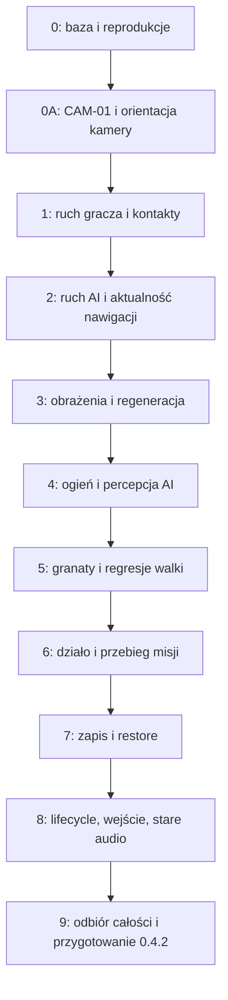

# Ziemia Niczyja 0.4.2 — plan napraw rozgrywki i stabilności

**Status: PLAN. Nie wykonano implementacji opisanych napraw ani wydania 0.4.2.**

Data opracowania: **6 września 2026**. Dokument powstał przez wydzielenie napraw
z dostarczonego `V0_5.md` z 5 września oraz przez niezależny przegląd kodu.
Repozytorium: `Mentiuszen/ziemianiczyja`, odczytany branch `main`, commit
**`fdf5c2ef41b8d097a187d22c0a2a22b3161a3c0f` (`v0.4.1`)**.
Wszystkie opisy aktualnego kodu odnoszą się do tego commitu, nie do przyszłego 0.4.2.

**Uzupełnienie z 6 września 2026 — `CAM-01`:** dodano zgłoszony screenshot
z przechylonym widokiem 3D oraz audyt orientacji kamery. Ponownie sprawdzony `main`
ma SHA `bbafbb939f705148da2f100e978539b971988539`; ten commit dodaje wyłącznie `CNAME`,
więc kod kamery nadal odpowiada bazie 0.4.1. [Zmiana po bazie][SRC-32]
Diagnoza i zakres dowodu: §3.3. Naprawa: §9.2 i etap 0A. Regresja integracyjna: §13.4.

**Cel:** naprawić trudność, zachowanie AI oraz blokowanie postaci na obecnej mapie,
a także błędy walki, celów, zapisu, cyklu życia i trwałego przechylenia kamery,
które mogą unieważnić te naprawy.
**Architektura:** `Simulation` pozostaje właścicielem stanu, czasu, ruchu i obrażeń.
Naprawiamy istniejące systemy; renderer i audio prezentują ich stan.
**Technologie:** obecny JavaScript ESM, Babylon.js, testy `node:test`, statyczny build Node.
**Dokument powiązany:** [V0_5.md](V0_5.md) — późniejsza przebudowa jakościowa.

> Dla wykonawcy: wszystkie checkboxy dotyczą przyszłej implementacji. Wyniki prób
> rozpoznawczych w §3 i §13 nie oznaczają naprawienia błędów. Najpierw reprodukcja,
> następnie minimalna naprawa, regresja i odbiór w grze. Nie zamykać zadania samym
> usunięciem objawu w jednym seedzie albo zmianą oczekiwań testu.

## 1. Zakres i nieprzekraczalne granice

0.4.2 jest **wydaniem naprawczym na mapie 0.4.1**, nie pomniejszoną wersją przebudowy 0.5.
Trzy priorytety użytkownika są obowiązkowe: uczciwa trudność, przewidywalne AI
oraz brak zakleszczeń postaci. Naprawa pierwszego z nich nie może polegać wyłącznie
na zmniejszeniu obrażeń, drugiego na wyłączeniu kolizji NPC, a trzeciego na `noclip`.
Dodatkowe zgłoszenie **trwale przechylonego horyzontu (`CAM-01`) również blokuje odbiór
patcha**. To naprawa orientacji istniejącej kamery, nie ulepszenie lub obracanie mapy.

| Wchodzi do 0.4.2 | Nie wchodzi do 0.4.2 |
|---|---|
| Profile obrażeń, regeneracji, reakcji i serii ognia; testy obecnych starć | Nowe sektory, nowe podejścia, przebudowa sieci okopów lub przesuwanie osłon dla lepszej kompozycji |
| Naprawa ruchu, opadania, postaw, kontaktów i spawnu | Nowe modele, tekstury, rig, klipy, osobna broń w dłoniach, ruchome gąsienice |
| Naprawa zleceń nawigacji, ustępowania, widoczności i zajmowania osłon | Pełny rewrite AI, nowy system taktyczny oddziału, nowy silnik fizyki lub nawigacji |
| Usunięcie niespójności działa, obrażeń, granatów, celów i checkpointów | Realistyczna biblioteka audio, dubbing, nowy miks przestrzenny i pogłos |
| Naprawa trwałego przechylenia kamery, przerwania ładowania, wznowienia, zapisu i utraty sterowania | Przebudowa menu, nowe tryby, dodatkowe misje, sterowanie pojazdami |
| Lokalna korekta błędnego collidera istniejącego obiektu, poparta reprodukcją | Usuwanie przeszkód, poszerzanie drzwi lub zmiana mapy zamiast naprawy kontrolera/AI |

Korekta collidera oznacza dopasowanie do **już istniejącej, widocznej bryły** albo
poprawę jego semantyki. Nie jest pozwoleniem na ukryte otwarcie drogi przez solidny płot.
Każdy taki wyjątek opisuje: ID obiektu, defekt, różnicę przed/po, zgodność ruchu,
pocisków i widocznej geometrii. Przebudowa `TRENCHES`, `RAMPS`, `northZ`, terenu
oraz projektowanego `trench-network.js` pozostaje wyłącznie w 0.5.

**Zasady globalne:**

- Nie tworzyć branchy ani worktree, nie przełączać istniejących. Ten dokument nie
  upoważnia do implementacji, commit/push, publikacji ani zmian ustawień GitHub.
- Nie zmieniać `public/assets/` ani generatorów modeli w ramach podnoszenia jakości.
  Porównać skróty zasobów przed i po wykonaniu 0.4.2; każdą konieczną naprawę
  uszkodzonego pliku traktować jako oddzielnie wykazany defekt, nie okazję do podmiany artu.
- Ustawienia Low/Medium/High/Ultra nie zmieniają liczby wrogów, obrażeń, kolizji,
  wykrywania, tras ani stanu misji. Czas gameplayu pochodzi z symulacji.
- Zachować istniejące zasady blokowania ognia przez sojuszników i wyłączenia obrażeń
  tej samej frakcji, także własnego granatu. Ich zmiana wymaga osobnej decyzji.
- Nie wymieniać Babylon.js, systemu budowania ani całych modułów niezwiązanych z błędem.
  Nie dodawać „przy okazji” nowych animacji, efektów ani elementów mapy.
- Wersję podnieść do `0.4.2` dopiero w przygotowaniu wydania. Nie cofać numeru
  istniejącego buildu; przed wykonaniem planu ponownie sprawdzić aktualny stan repo.

## 2. Co przeniesiono z pierwotnego planu 0.5

Numery w pierwszej kolumnie odnoszą się do **oryginału z 5 września**, nie do nowych etapów.

| Pierwotny zakres | Właściciel po podziale | Co pozostaje do zrobienia w 0.5 |
|---|---|---|
| §7.1–7.2; etap 1: płot, pionowy ruch, postawy, penetracja, spawn | 0.4.2 §4; etapy 1–2 | Regresja tego samego kontrolera na nowych modułach i terenie, bez ponownej implementacji napraw |
| §8.2–8.3; część etapu 2: obrażenia, regeneracja, reakcja, serie | 0.4.2 §5–6; etapy 3–4 | Strojenie odziedziczonego systemu na nowej mapie i przy nowym audio |
| §8.4: pomiary seedów i ludzki odbiór trudności | Oba wydania, oddzielne wyniki | Ponowny odbiór po zmianie ekspozycji, tras i sygnałów zagrożenia |
| §9: oddział nie blokuje przejścia; naprawcza część etapu 6 | 0.4.2 §4 i §6 | Dalsze zachowania taktyczne i prezentacja oddziału, nie bazowa naprawa ustępowania |
| §9: bezpieczne checkpointy; naprawcza część §11 | 0.4.2 §8 | Dostosowanie do nowych pozycji, identyfikatorów i wersji misji |
| §7.2 i etap 7: reload/pauza, fokus, efekty po loadzie, błędy ładowania | 0.4.2 §7–9 | Regresje oraz integracja nowych animacji i banku audio |
| §4–6: modele, animacje, realistyczne audio, przebudowa mapy | Wyłącznie 0.5 | Cały zakres jakościowy pozostaje w zaktualizowanym `V0_5.md` |
| Nowe ustalenia skanu: kolejka tras, stan działa, walidacja, późny wynik ładowania | 0.4.2, rejestr w §3.2 | Utrzymanie napraw jako warunku wejścia i regresji |

**Przeniesienie zadania nie jest jego ukończeniem.** 0.5 startuje z odebranego 0.4.2.
Nie należy zostawiać dwóch niezależnych implementacji obrażeń, kolizji ani AI tylko
dlatego, że oba plany wspominają o ich odbiorze.

## 3. Niezależny skan kodu i siła dowodów

### 3.1. Zakres rzeczywiście wykonanej analizy

Przejrzano kontroler gracza, kolizje i indeks przestrzenny, AI i nawigację,
obrażenia/zdrowie/broń, koordynację symulacji, dyrektora misji, zapis,
ładowanie aplikacji, wejście, proceduralne audio, logikę czołgów/działa/lotnictwa,
definicje mapy i colliderów, dotychczasowe testy kolizji oraz dokumentację testową.
Katalog źródeł z przypiętym SHA znajduje się w §14.

To **ukierunkowany audyt rozgrywki**, nie dowód braku wszelkich błędów w całym repozytorium.
Nie wykonano przeglądu jakości wszystkich modeli, pełnego audytu renderera ani
benchmarku GPU. Takie rozszerzenie nie jest potrzebne do wydzielenia tego patcha.

W środowisku tej analizy uruchomiono Node **v22.16.0** i wyizolowane próby:

| Próba | Wynik na niezmienionych funkcjach 0.4.1 | Granica tego dowodu |
|---|---|---|
| Cztery istniejące testy `v04-collision.test.mjs` | **4/4 PASS** | Skopiowane testy z jedynie dostosowaną ścieżką importu; nie cały `npm test` |
| Opadanie na niechodliwą belkę | Start bez penetracji; pierwsza penetracja w kroku 5; postać kończy w belce i nie cofa się | Płaski fixture z belką, nie odtworzenie dokładnej pozycji zgłoszenia użytkownika |
| Początkowe nakładanie przy belce | Postać na `x=-0.28` pozostaje zablokowana mimo 60 poleceń cofania | Konkretny przypadek penetracji; nie twierdzenie, że każde minimalne nakładanie zawsze blokuje |
| Dwa kolejne zlecenia ruchu | Drugie żądanie `x=-10` przegrywa z wcześniejszym `x=10` | Rzeczywiste `request/process`; samo obliczanie A* zastąpione deterministycznym stubem |
| Odejście i powrót obsługi działa | `operational=false`, ale po powrocie obsługi powstaje pocisk i amunicja spada z 18 do 17 | Rzeczywisty `updateFieldGun`; uproszczony świat, bez osłon i renderera |

Sześć modułów wykorzystanych do prób odtworzono bajtowo z odczytów GitHub
(`math`, `world-map`, `spatial-index`, `collision`, `navigation`, `field-gun`),
a ich Git blob SHA sprawdzono względem źródła. Również treść czterech istniejących
testów po odwróceniu zmiany importu daje oryginalny blob.
Reprodukcje i ograniczenia zapisano w §13.

**Nie wykonano w tej analizie:** pełnych 134 testów projektu, `npm run check`,
budowania projektu, `autoplay`, przeglądarkowego przejścia gry ani ludzkiego odbioru misji.
Uzupełnienie kamery w §3.3 wykorzystuje pobrany istniejący artefakt, nie nowy build;
próbę wejścia przeglądarką do lokalnej strony zablokowała polityka środowiska.
Liczba 134 i test Chromium na RTX 3060 pochodzą z wcześniejszego raportu 0.4.1,
nie z tego skanu. [Raport istniejącego wydania][SRC-23]

### 3.2. Rejestr problemów i zadań

Oznaczenia: **E** — odtworzone wykonaniem izolowanej próby; **K** — mechanizm lub
brak zabezpieczenia potwierdzony odczytem kodu, bez odtworzenia pełnej sytuacji w grze;
**H** — hipoteza/ryzyko wymagające próby, nie potwierdzony incydent.
**P0** blokuje sterowanie lub przejście. **P1** narusza główne kryteria patcha.
**P2** wymaga ograniczonej poprawki albo weryfikacji; nie uzasadnia rozszerzenia o nowe funkcje.

| ID / priorytet / dowód | Ustalenie i skutek | Właściciel naprawy / test |
|---|---|---|
| **COL-01 · P0 · E** | `CollisionWorld.move` sprawdza kolizję pionową przy ruchu w górę, ale opadanie przypisuje `ny` bez równoważnego sprawdzenia całej bryły. Można opaść w belkę i pozostać zablokowanym. [Źródło][SRC-01] | §4; etap 1; `v042-collision.test.mjs` |
| **COL-02 · P0 · E** | Ruch akceptuje tylko wolną pozycję docelową. Z odtworzonego początkowego nakładania nie można wyjść małymi poprawnymi poleceniami; brak dedykowanego, walidowanego rozwiązywania penetracji. [Źródło][SRC-01] | §4; etap 1; `v042-collision.test.mjs` |
| **COL-03 · P1 · K/H** | Zmiana postawy sprawdza przestrzeń, lecz sam obrót leżącego gracza zmienia `yaw` bez walidacji końców sylwetki; końce prone nie sprawdzają też innych aktorów. Ruch/obrót dynamicznego czołgu wymaga osobnej próby wtłoczenia gracza w otoczenie. [Gracz][SRC-02] [Kolizje][SRC-01] [Czołg][SRC-17] | §4; etapy 1–2; testy postaw i dynamicznych kontaktów |
| **DIF-01 · P1 · K** | Gewehr 100 × głowa 1,6 × Żołnierz 0,82 daje **131,2 HP**. Regeneracja jest stała 6 s / 12 HP/s, a jeden `incoming` obejmuje kule i eksplozje. To nie odosobniony suwak balansu. [Dane][SRC-07] [Trafienia][SRC-06] [Zdrowie][SRC-08] [Obrażenia][SRC-05] | §5; etap 3; `v042-difficulty.test.mjs` |
| **AI-01 · P1 · K** | Automaty przeciw graczowi nie otrzymują przerwy po serii, choć mają ją przeciw NPC. Celowanie w gracza używa punktu blisko oczu; `targetId` jest zerowane po utracie widoczności i ponowne wykrycie odnawia reakcję. [Źródło][SRC-03] | §6; etap 4; `v042-ai-combat.test.mjs` |
| **AI-02 · P1 · E** | `request` ignoruje nowy cel przy `pathPending`; `process` przyjmuje stare zadanie bez tokenu aktualności. Ucieczka, zmiana celu lub rozkaz mogą przegrać ze starą trasą. [Źródło][SRC-04] | §6; etap 2; `v042-navigation.test.mjs` |
| **AI-03 · P1 · K** | Ustępowanie już istnieje, ale bywa pomijane przez wcześniejsze `return`. W innych ścieżkach wywołuje `collision.move` drugi raz z pełnym `dt`, ponownie integrując pion. Osłona zwalnia `owner`, lecz zostawia `coverId`, które restore znowu rezerwuje. [AI][SRC-03] [Nawigacja][SRC-04] [Restore][SRC-05] | §4 i §6; etap 2; `v042-ai-movement.test.mjs` |
| **AI-04 · P2 · K** | Percepcja stale rozpatruje tylko pięciu najbliższych przeciwników. Pięciu zasłoniętych może uniemożliwić sprawdzenie szóstego widocznego. Nie dowodzi to problemu w każdym starciu. [Źródło][SRC-03] | §6; etap 4; deterministyczny fixture sześciu kandydatów |
| **COM-01 · P1 · K** | Granat gracza powstaje pół metra przed okiem bez sprawdzenia odcinka oko→miejsce utworzenia. Początkowy offset może ominąć cienką przeszkodę; tor jest badany dopiero od utworzonego punktu. [Gracz][SRC-02] [Tor][SRC-06] | §7; etap 5; `v042-combat.test.mjs` |
| **COM-02 · P2 · K** | Tłumienie ogniem mierzy odległość od końca strzału, nie od przelotu. Kierunek obrażeń granatu może wskazywać jego właściciela, nie wybuch, bo `blast` przekazuje właściciela bez osobnego punktu obrażeń. [Balistyka][SRC-06] [Obrażenia][SRC-05] | §5 i §7; etapy 3–5; testy przelotu i origin obrażeń |
| **MIS-01 · P1 · E** | Działo po braku obsługi ma `operational=false`; powrót obsługi nie przywraca flagi, a kod dopuszcza strzał. Dyrektor zalicza artylerię na podstawie tej flagi. Stan celu i ostrzału są niespójne. [Działo][SRC-18] [Misja][SRC-10] | §7; etap 6; `v042-mission.test.mjs` |
| **MIS-02 · P1 · H** | Śmierć w środku kroku nie kończy wszystkich późniejszych aktualizacji; dyrektor i odbiorca zdarzeń mogą następnie rozpatrzyć zakończenie misji. Sprawdzić jednoczesny zgon i koniec obrony, nie zakładać zaobserwowanego błędu UI. [Tick][SRC-05] [Misja][SRC-10] [Aplikacja][SRC-13] | §7; etap 6; test jednego stanu terminalnego |
| **MIS-03 · P2 · H** | Interakcje opierają się głównie na odległości XZ. Sprawdzić użycie przez ścianę/strop i różnicę między promptem a faktycznym działaniem. Finał już ogranicza contest do okolicy telefonu; badać nieosiągalnego pobliskiego wroga, nie „ostatniego wroga gdziekolwiek”. [Symulacja][SRC-05] [Misja][SRC-10] | §7; etap 6; testy z istniejącymi colliderami |
| **SAV-01 · P1 · K** | Checkpoint czeka na brak pocisków i koniec `health.delay`, ale nie sprawdza penetracji, podparcia ani dostępnej kontynuacji. Restore nie wykonuje pełnej walidacji pozycji gracza. [Misja][SRC-10] [Restore][SRC-05] | §8; etap 7; `v042-save.test.mjs` |
| **SAV-02 · P1 · K** | Walidator bada `path`, ale nie `pathIndex`; przepuszczony ujemny indeks prowadzi do odwołania do nieistniejącego waypointu. Nie waliduje też wszystkich używanych pól ruchu/postaw/timerów ani wartości `difficulty`. [Schemat][SRC-11] [Konsument][SRC-03] | §8; etap 7; uszkodzone kopie poprawnego snapshotu |
| **LIF-01 · P1 · K** | `Application.start` ma sprawdzenia generacji po imporcie i modelach, ale nie po `await store.save(...)`. Późny zapis może doprowadzić starą operację do `go('ready')` po wyjściu lub uruchomieniu innej misji. [Źródło][SRC-13] | §9; etap 8; `v042-lifecycle.test.mjs` |
| **AUD-01 · P2 · K/H** | `audio.resume` po `await` ustawia `enabled=true` bez sprawdzenia aktualności. Reload planuje opóźnione dźwięki bez identyfikacji akcji. Wymagają próby przy przerwaniu, pauzie i zmianie misji; nie jest to dowód wycieku pamięci. [Źródło][SRC-15] | §9; etap 8; sterowane obietnice i fałszywy kontekst audio |
| **PERF-01 · P2 · K/H** | `chooseCover` uruchamia `path` synchronicznie dla kandydatów, poza kolejką `process(2)`. Ograniczenie kolejki nie ogranicza całego A*. Wpływ na czas klatki wymaga pomiaru. [Źródło][SRC-04] | §6 i §11; etapy 2–9; liczniki i pomiar CPU |
| **CAM-01 · P1 · E/K** | Po krótkim `rotation.z` od wybuchu kamera może zachować `upVector` dla poprzedniego pitch/yaw. Późniejszy obrót daje trwałe przechylenie widoku przy `rotation.z=0`. Na oryginalnej metodzie Babylon z buildu odtworzono około **12°**, a aktualizowanie wektora z pełnej bieżącej orientacji dało **0°**. To dowód mechanizmu, nie odtworzenie zapisu klatek ze screena. [Kamera gry][SRC-27] [Efekty][SRC-28] [Runtime][SRC-30] | §3.3 i §9.2; etap 0A; izolowana próba + obowiązkowy `tools/browser_v042_camera.py` na prawdziwym `GameView` |
| **DOC-01 · P2 · K** | `KNOWN_ISSUES` zawiera starsze „brak fizycznego GPU”, choć nowszy raport 0.4.1 opisuje próbę RTX 3060. W obu pozostaje brak realnego testu Firefox. Uzgodnić daty i zakres, nie zmieniać historii w fikcyjne PASS. [Ograniczenia][SRC-22] [Raport][SRC-23] | Etapy 0 i 9; dokumentacja wydania |

**Nie dopisywać jako nowych braków:** obsługa blur/visibility/Pointer Lock,
blokowanie pocisku przy osłonie, atomowe przeładowanie, fizyczna strzelnica MG,
ograniczona strefa contest finału i ustępowanie sojuszników już istnieją.
Wymagają utrzymania lub poprawy wykazanego przypadku, nie kolejnej równoległej
implementacji. [Wejście][SRC-14] [Balistyka][SRC-06] [Broń][SRC-09] [Mapa][SRC-20]

### 3.3. Uzupełnienie: trwały przechył obrazu — `CAM-01`

**Obserwacja użytkownika:** screenshot wersji 0.4.1 pokazuje przechyloną scenę 3D,
przy poziomym interfejsie. Widoczne są 100 HP oraz licznik 165 FPS. Sam obraz nie
ujawnia wcześniejszego wybuchu, ustawień ruchu kamery ani historii ruchów myszą;
nie traktować tych szczegółów jako odczytanej ze screena sekwencji zdarzeń.

**Przyczyna potwierdzona w kodzie:** `GameView` tworzy `TargetCamera` bez ustawienia
`updateUpVectorFromRotation`. `sync()` ustawia trzy kąty kamery, w tym przechył
`Math.sin(time*47) * trauma * .008 * motion`. W dołączonym Babylon.js 8.46.2 domyślnie
wyłączone jest wyprowadzanie `upVector` z pełnej aktualnej rotacji przy każdym
przeliczeniu widoku. Ścieżka Eulera aktualizuje ten wektor przy zmianie `rotation.z`,
zapamiętując wtedy także wpływ pitch/yaw. Gdy wstrząs wygaśnie i `z` pozostaje zerowe,
dalsza zmiana kierunku patrzenia może używać starego wektora. Wynikowa macierz
widoku jest przechylona, mimo zerowego zadanego kąta Z. [Gra][SRC-27]
[Dołączona biblioteka][SRC-30] [Czytelny odpowiednik źródła 8.46.2][SRC-31]

`Effects.event('explosion')` zwiększa `trauma` zależnie od dystansu, z limitem 1,
a `update()` zmniejsza ją o `dt * 2.6`. Wywołanie efektu nie wymaga utraty HP.
Przy `motion=1` zadany przechył ma amplitudę najwyżej `0.008 rad ≈ 0.458°`, a przy
`motion=0.45` około `0.206°`. Są to obliczenia z kodu, nie pomiar kąta screena.
Duży, trwały przechył po zakończeniu efektu nie jest zamierzonym zakresem wstrząsu.
Nie wskazuje też sam w sobie na błąd kolizji lub normalnych terenu. [Efekt][SRC-28]

**Wykonany test uzupełniający:** pobrano już istniejący artefakt `github-pages`
z runu `34028953405`, artefakt `9987969229`, dla SHA `bbafbb9…`.
SHA-256 ZIP zgadza się z metadanymi Actions:
`70b91982e7e866ce9c71a62b9ac2be220b6c63ba993a98d111eceacde6913b23`.
Uruchomiono w Node 22.16.0 **oryginalną metodę `TargetCamera._getViewMatrix()` i
oryginalną matematykę wektorów/macierzową dołączonej biblioteki**, bez zmiany bundla.
Stan kamery był kontrolowanym fixture utworzonym na jej prototypie, bez konstruktora
`GameView`, pełnej sceny i WebGL. Minimalne atrapy DOM służyły tylko do importu
nieużywanych deklaracji elementów HTML; nie zastępowały matematyki kamery.

| Izolowana próba kamery | Rzeczywisty wynik | Granica dowodu |
|---|---|---|
| Pitch 12°, krótki roll 0.003 rad → roll 0 → pitch 0 i yaw 90° | `rotation.z=0`, ale przechył wyliczony z macierzy **11.99999938°** | Reprodukcja mechanizmu, nie dokładnej pozycji użytkownika |
| Ta sama sekwencja z `updateUpVectorFromRotation=true` | Przechył **0°** | Opcja zmieniona wyłącznie w izolowanym fixture, nie w źródłach gry |
| 819 kombinacji początkowego pitch i końcowego pitch/yaw | Brak pozostałego przechyłu ponad tolerancję `0.000001 rad` przy włączonej opcji | Test matematyki orientacji, nie 819 przejść misji |
| 25 kombinacji pitch i kontrolowanego roll | Zachowany zadany mały przechył w tej samej tolerancji | Naprawa nie wymaga wyłączania zamierzonego wstrząsu |
| Próbkowanie wzoru `sync` i zaniku `trauma` z 30/60/120/144/165 próbkami/s, `motion=0.45/1` | Stara konfiguracja odtwarza około 12°; konfiguracja skorygowana wraca do 0° | Syntetyczne próbkowanie w Node, **nie pomiar FPS ani test renderu** |

Pięć testów diagnostycznych zakończyło się **5/5 PASS**: pierwszy potwierdza
występowanie błędu, następne sprawdzają wariant konfiguracji. Osobny model algebraiczny
dał ten sam wynik, ale nie jest traktowany jako dodatkowy test produkcyjnego silnika.
Próba uruchomienia aplikacji w Chromium przez lokalny HTTP zakończyła się
`ERR_BLOCKED_BY_ADMINISTRATOR` przed wczytaniem gry. **Nie ma browser PASS, pomiaru GPU
ani potwierdzenia kompletnego przejścia ze screena.** Odbiór konfiguracji prawdziwego
`GameView` i całego toru zdarzenie→wstrząs→render pozostaje wymaganiem §9.2/§13.4.

## 4. Ruch, kontakty i blokowanie postaci

### 4.1. Jedno rozstrzygnięcie pełnego ruchu

Właściciel: `src/world/collision.js`, kontrola wejścia/postawy w `src/core/player.js`.
`src/world/spatial-index.js` pozostaje broadphase; nie zastępuje testów pionowych.

- [ ] Zachować cztery istniejące regresje i dodać opadanie w belkę z §13.1.
  Nowy test musi wykazywać defekt starego kodu; końcowy test sprawdza każdy krok,
  nie tylko pozycję po zakończeniu upadku.
- [ ] Rozpatrywać trajektorię pełnej bryły w dół, w górę i poziomo. Podkroki/sweep
  mają obejmować również prędkość pionową i sytuację dłuższej klatki. Nie wystarczy
  sprawdzenie jednego punktu stóp ani tylko końcowej pozycji po przeskoczeniu belki.
- [ ] Rozdzielić: blokowanie ruchu, promienia, możliwość automatycznego wejścia
  na stopień i stabilne podparcie. `walkableTop=false` jest już używane przy płotach;
  sam ponowny zakaz chodzenia po płocie nie naprawia `COL-01`.
- [ ] Kontakt z niechodliwą belką nie może zostać zignorowany przy spadaniu.
  Kontakt zatrzymuje penetrację, ale nie przykleja gracza do płotu jako stałej podłogi;
  normalne sterowanie musi pozwolić zejść/wycofać się na wolną stronę.
- [ ] Ustalić jedną tolerancję kontaktu i ograniczony limit iteracji rozwiązania.
  Nie dodawać niezależnych, coraz większych epsilonów do kolejnych przypadków.
- [ ] Zachować istniejące wejście na szeroki niski podest, ograniczenie skarpy,
  prześwit nad głową i zakaz automatycznego „step-up” w powietrzu.

### 4.2. Wyjście z penetracji, postawy i bezpieczna pozycja

- [ ] Przed ruchem rozpoznać początkowe nakładanie i znaleźć ograniczoną korektę
  do wolnej przestrzeni. Korekta uwzględnia wszystkie aktywne bryły, innych aktorów,
  teren i granice gry; nie przenosi przez przeciwległą ścianę ani na drugą stronę płotu.
- [ ] Osobno sprawdzić fixture `x=-0.28` z §13.1. Cofanie zmniejszające penetrację
  nie może zostać zablokowane wyłącznie dlatego, że pojedynczy mały krok jeszcze
  nie usuwa całego nakładania. Wynik końcowy musi być bezkolizyjny.
- [ ] Zapamiętywać ostatnią **zweryfikowaną** pozycję bez penetracji i z poprawnym
  podparciem. Powrót do niej jest ograniczonym trybem awaryjnym, nie zwykłą lokomocją.
  Rejestrować użycie, dystans i przyczynę. Ponownie walidować punkt względem aktualnego
  czołgu/NPC; stary punkt może być dziś zajęty.
- [ ] Gdy nie ma bezpiecznej lokalnej korekty ani poprawnego punktu awaryjnego,
  nie używać dalekiego teleportu. Kontrolowanie odrzucić niebezpieczny spawn/load
  lub przywrócić poprzedni bezpieczny checkpoint, z czytelnym komunikatem.
- [ ] Sprawdzać pełną sylwetkę przy staniu, kucaniu, leżeniu i **obrocie w leżeniu**.
  Końce leżącej bryły sprawdzają również aktorów. Nie zmniejszać hitboxu ruchu
  tylko po to, żeby przejść przez istniejące przeszkody.
- [ ] Skok lub istniejąca próba przeskoku nie może wymusić stania pod niskim sufitem.
  Walidować bieżące przejście postawy i tor, nie sam punkt docelowy.
- [ ] Rozdzielić wykrywanie utknięcia od celowego naciskania na ścianę. Za defekt
  uznawać m.in. penetrację lub niemożność ruchu do wykazanej wolnej przestrzeni;
  samo `moved=false` przy ścianie nie uruchamia korekty.

### 4.3. NPC i przeszkody dynamiczne

Właściciel: również `src/ai/soldier.js` i lokalne testy ruchu w `src/vehicles/tank.js`.
Nie dodajemy fizycznego przepychania tłumu ani sterowania czołgiem przez gracza.

- [ ] AI ustala zamiar ruchu i ustępowania, po czym grawitacja i kontakty pionowe
  są integrowane **raz na krok**. Usunąć drugą integrację `dt` z ruchu ustępującego.
  Wydzielenie wewnętrznego ruchu poziomego jest dopuszczalne; drugi właściciel fizyki nie.
- [ ] Wcześniejsze wyjście z logiki ognia lub dotarcia do waypointu nie pomija
  obowiązkowej aktualizacji podparcia i rozpatrzenia ustąpienia w drzwiach.
- [ ] Ustępowanie wybiera sprawdzoną wolną stronę, a gdy obie są niedostępne,
  dopuszcza odwrót do lokalnego miejsca mijania/wait. Nie przesuwa NPC bezkolizyjnie
  przez ścianę, gracza ani drugiego sojusznika.
- [ ] Sprawdzić ruch i zmianę yaw czołgu obok gracza/NPC i ściany. Jeżeli próba
  wykaże penetrację, zatrzymać/przyciąć niedozwolony ruch/obrót pełnej bryły przed
  zatwierdzeniem stanu. Dwa punkty z przodu nie są dowodem bezkolizyjności boku.
- [ ] Przeszkoda zniszczona zgodnie z istniejącą logiką znika z kolizji i nawigacji
  jednocześnie. Nie czynić reszty płotów niszczalnymi przy okazji tego zadania.

**Odbiór:** brak penetracji po kroku, brak przejścia przez ścianę i brak pętli korekt;
możliwość zwykłego wycofania w fixture oraz na rzeczywistych płotach, przy drzwiach,
workach, skrzyniach, deskach, ruinach i czołgu. Ręczna trasa obejmuje m.in. istniejące
płoty w okolicy `(-88,29)`, `(-58,29)`, `(63,119)` i północnych ruin, nie przebudowę
ich położenia. Dokładna reprodukcja pierwotnego zgłoszenia nadal pozostaje osobnym
kryterium: brak jej odnalezienia nie jest dowodem, że wszystkie przypadki są usunięte.

## 5. Trudność i jedno rozstrzygnięcie obrażeń

### 5.1. Profile startowe przeniesione z 0.5

Zachować **Rekruta, Żołnierza i Weterana**. Podstawowy odbiór dotyczy Żołnierza.
Poniższa tabela to **propozycja pierwszej iteracji**, wydzielona z pierwotnego planu,
nie wynik nowego playtestu ani odwzorowanie ukrytych parametrów Call of Duty 2.
Kierunek inspiracji pozostaje: rozpoznanie zagrożenia → osłona → regeneracja → powrót
do walki. Nie ma ukrytej nieśmiertelności, minimalnego 1 HP ani losowego anulowania trafień.

| Parametr | Rekrut | Żołnierz | Weteran |
|---|---:|---:|---:|
| Mnożnik obrażeń broni ręcznej otrzymywanych przez gracza | 0,25 | 0,35 | 0,65 |
| Mnożnik obrażeń wybuchu otrzymywanych przez gracza | 0,55 | 0,75 | 1,00 |
| Mnożnik głowy gracza dla zwykłego hitscanu | 1,25 | 1,25 | 1,25 |
| Gewehr: obrażenia tułów / głowa przy bazowych 100 | 25 / 31,25 | 35 / 43,75 | 65 / 81,25 |
| Trafienia Gewehrem w tułów do śmierci z 100 HP, bez leczenia | 4 | 3 | 2 |
| Przerwa bez obrażeń przed regeneracją | 3,0 s | 4,0 s | 5,0 s |
| Regeneracja | 25 HP/s | 20 HP/s | 16 HP/s |
| Reakcja po nowym, rzeczywistym wykryciu gracza | 1,0–1,5 s | 0,7–1,2 s | 0,45–0,8 s |

Nie wydłużać walki HP przeciwników ani nie osłabiać strzałów gracza w ramach jego
własnej ochrony. Bezpośredni ciężki pocisk i bliski wybuch nadal mogą zabić;
muszą respektować osłonę i istniejące ostrzeżenia. Przy wielu kierunkach ognia nie
wprowadzać magicznego limitu wrogów, którym wolno zadawać obrażenia.

### 5.2. Kontrakt obrażeń i zdrowia

Obecnie `fireBullet` mnoży trafienie w część ciała przed `Simulation.damage`, a ten
sam `incoming` redukuje różne źródła. Zmiana wymaga przejścia **wszystkich wywołań**,
nie dopisania kolejnego mnożnika na końcu. [Balistyka][SRC-06] [Symulacja][SRC-05]

Proponowany kontrakt 0.4.2, **nie istniejące dziś rozszerzenie API**:

```js
world.damage(target, baseAmount, source, {
  kind: 'bullet',       // 'bullet' | 'explosion' | 'melee'
  hitPart: 'torso',     // 'head' | 'torso' | 'limb'; dotyczy kul
  origin: impactOrigin,
  weaponId: weapon.id,  // wymagane dla strzału z rozpoznanej broni
});
```

- [ ] `Simulation.damage` jest jedynym miejscem zatwierdzającym zmianę HP i skutki
  śmierci. Czysty pomocnik obliczający kwotę jest dozwolony, ale nie drugi właściciel stanu.
- [ ] Przekazywać bazową moc i kontekst: kula ręczna, kula stanowiska/pojazdu,
  melee, granat, pocisk artyleryjski i bomba. Granat/odłamki nie dostają mnożnika głowy.
- [ ] Mnożnik części ciała naliczać raz: głowa gracza 1,25, głowa NPC nadal 1,6,
  kończyna nadal 0,57. Te wartości nie zmieniają się przypadkiem przez wspólny helper.
- [ ] Zachować istniejącą redukcję 0,72 dla odpowiednich obrażeń NPC→NPC oraz wyjątek
  istniejącego wsparcia czołgowego. Testować wynik wszystkich kierunków obrażeń,
  nie tylko nominalny profil gracza. `damageTank` pozostaje oddzielnym kontraktem pancerza.
- [ ] Dla istniejącej ścieżki melee zachować dotychczasowy wynik; nie przypisywać jej
  automatycznie nowego mnożnika eksplozji. Gdy brak aktualnego napastnika melee dla
  gracza, nie dodawać go jako nowej funkcji tego patcha.
- [ ] Ochronę tej samej frakcji sprawdzać przed zmianą HP i zdarzeniami. Zachować
  fizyczne zasłanianie celu przez sojusznika mimo braku friendly fire.
- [ ] `origin` dla granatu/bomby/pocisku oznacza miejsce wybuchu, a nie pozycję właściciela.
  Dla zwykłego trafienia zachować czytelny kierunek napastnika. Nie modyfikować obiektu
  właściciela, aby zasymulować inną pozycję źródła.
- [ ] `Health` otrzymuje efektywny profil regeneracji z symulacji po wyborze trudności
  i po restore. Aktualne `hp` i pozostały `delay` pozostają stanem, nie kopią całej konfiguracji.
- [ ] Zachować prawidłowe leczenie wyłącznie przez część kroku po wyzerowaniu opóźnienia,
  reset opóźnienia po trafieniu, górny limit 100 i brak regeneracji po śmierci.
- [ ] Wyświetlane timery i wskazówki w ustawieniach, odprawie i ekranie śmierci
  odczytują efektywny profil. Sprawdzić wszystkie aktualne napisy; nie zakładać bez
  odczytu, że każdy z nich dziś zawiera błędną stałą.

**Trudność w zapisie:** obowiązuje profil misji zapisany przez `difficultyId`.
Zmiana ustawienia w menu określa nową misję, nie po cichu środek wczytanego checkpointu.
UI musi pokazać efektywną trudność wczytanej gry. Inne zachowanie wymaga jawnej decyzji,
nie ubocznego skutku naprawy konfiguracji.

## 6. AI: walka, widoczność, nawigacja i osłony

### 6.1. Ogień i percepcja

- [ ] Przeciw graczowi MG 08 i Lewis stosują rzeczywiste serie i przerwy. Na pierwszą
  próbę Żołnierza przyjąć **3–5 strzałów i 0,8–1,4 s przerwy** z pierwotnego planu.
  Rekrut nie może mieć krótszego odpoczynku ani większego nacisku niż Żołnierz,
  Weteran nie może być łatwiejszy z powodu odwróconych parametrów.
- [ ] Nie omijać mechanicznego cooldownu `Weapon`. Odtworzenie stanu, zmiana celu,
  reload i chwilowe zasłonięcie nie mogą uruchamiać nowej pełnej serii w każdej klatce.
- [ ] Rozdzielić tożsamość rozpoznanego celu, jego bieżącą widoczność i pamięć ostatniej
  obserwacji. Krótkie zasłonięcie nie odnawia bez końca całego opóźnienia reakcji;
  po rzeczywistym porzuceniu celu nowe wykrycie znowu stosuje profil.
- [ ] Pierwsza iteracja może wykorzystać obecną pamięć ostatniej pozycji do 5 s;
  zachowanie sprawdzić dla zasłonięcia 0,1 s, 1 s oraz czasu ponad przyjętą pamięć.
  W czasie braku widoczności AI nie dostaje aktualnej pozycji gracza zza ściany.
- [ ] Celować w sprawdzoną widoczną część sylwetki, z preferencją tułowia, gdy jest
  odsłonięty. Nie strzelać automatycznie w środek zakrytego ciała ani zawsze blisko oczu.
  Ograniczyć szybkość korekty yaw i pitch; nie wprowadzać strzału „bokiem” przed złożeniem.
- [ ] Badać osobno widzenie i wolną linię fizycznego strzału. Zachować istniejące
  zabezpieczenie oko→wylot oraz wylot→cel. AI ma umieć nie marnować każdej serii
  we własnej osłonie, zamiast wyłączać to zabezpieczenie.
- [ ] Przy pięciu zasłoniętych bliższych kandydatach szósty widoczny przeciwnik musi
  zostać zbadany w ograniczonym czasie. Rozłożyć badanie kandydatów pomiędzy aktualizacje;
  nie usuwać budżetu ani nie odpytywać wszystkich par co krok.
- [ ] Zmienna `pressure` wymaga wyszukania konsumentów w całym repo. W przejrzanych
  systemach nie znaleziono użycia sterującego walką. Usunąć martwy parametr lub nadać
  mu jedno udokumentowane znaczenie w profilu serii; nie mnożyć nim ponownie obrażeń.

### 6.2. Aktualność ścieżek i rezerwacje

- [ ] Zlecenie trasy otrzymuje identyfikator/generację zamiaru. Nowe zlecenie zastępuje
  stare oczekujące, a przerwanie rozkazu unieważnia wynik, którego nie wolno już zastosować.
  Kolejka nie rośnie o duplikaty tej samej prośby co klatkę.
- [ ] `process` sprawdza życie aktora oraz aktualność zlecenia przed zatwierdzeniem
  `path`, `pathIndex` i `pathTarget`. Ucieczka przed granatem ma pierwszeństwo przed
  wcześniejszym marszem do osłony. Atak, śmierć i nowa faza misji anulują nieaktualną trasę.
- [ ] Nie zapisywać surowej kolejki zawierającej referencje runtime. Po restore
  odtworzyć poprawny bieżący zamiar albo jawnie zlecić jego ponowne obliczenie;
  nie gubić pilnego celu tylko dlatego, że `pathPending` nie było serializowane.
- [ ] Właściciel osłony i `actor.coverId` mają jeden kontrakt. Zajęta osłona pozostaje
  zajęta przy dojściu; zwolnienie przy odejściu/śmierci/anulowaniu czyści oba odniesienia.
  Snapshot i restore dają ten sam zbiór zajętych osłon.
- [ ] Replan nie powtarza bez końca identycznej niedrożnej próby. Zapisać powód
  blokady i uwzględnić aktualną przeszkodę lub wybrać wolne lokalne oczekiwanie.
  Samo wyzerowanie `stuck` co 1,6 s nie jest dowodem usunięcia problemu.
- [ ] Policzyć wszystkie wyszukiwania A*, również z `chooseCover`, i koszt liczby
  kandydatów. W razie wykazanego przekroczenia budżetu ograniczyć kandydatów lub
  rozłożyć obliczenia w istniejącej kolejce. Nie zamieniać tego patcha w rewrite nawigacji.

**Odbiór AI:** żołnierz reaguje na rzeczywistą obserwację, nie strzela ciągłym automatem
bez odpoczynku, potrafi ustąpić, nie wykonuje starego rozkazu po nowym i nie rezerwuje
osłony inaczej po wczytaniu. Gracz nie może neutralizować wszystkich strzelców
samym szybkim chowaniem/wychylaniem, ale przeciwnik nie zna pozycji przez ścianę.

## 7. Pozostałe naprawy walki i misji

### 7.1. Granaty, przelot i istniejąca obsługa broni

- [ ] Utworzenie granatu poprzedzić testem wolnego odcinka od ręki/oka do startu
  toru, z marginesem jego reprezentowanej bryły. Jeżeli ściana jest wcześniej,
  granat nie powstaje po jej drugiej stronie. Niedozwolony start nie zużywa zapasu
  ani nie tworzy zdublowanego zdarzenia; alternatywę bezpiecznego startu przy ścianie
  sprawdzić na tej samej stronie przeszkody.
- [ ] Test obejmuje cienką ścianę, narożnik, niski strop, stojącego sojusznika,
  kucanie/leżenie i rzut blisko własnych nóg. Nie zmieniać friendly fire.
- [ ] Tłumienie ogniem odnosić do najbliższego punktu **rzeczywiście przebytego**
  odcinka strzału, kończącego się na pierwszej przeszkodzie. Nie tłumić za ścianą
  od teoretycznego promienia przechodzącego dalej; zachować limity i zanikanie efektu.
- [ ] Broń nadal zużywa amunicję raz na skutecznie rozpoczęty strzał. Reload przenosi
  amunicję atomowo na końcu, a jego przerwanie nie tworzy nabojów. Sprawdzić pauzę,
  zmianę slotu, podniesienie Lewisa, końcówkę rezerwy i snapshot tuż przed ukończeniem.
- [ ] Strzał przy osłonie nie znika bez uzasadnienia: brak trafienia celu może wynikać
  z fizycznego wylotu. Weryfikować punkt impact i jego przyczynę, nie usuwać raycastu.

### 7.2. Działo i spójność celu

- [ ] Oddzielić **trwałe unieszkodliwienie** od **chwilowego braku obsługi w zasięgu**.
  Wyłączony zamek lub definitywna utrata obsługi kończą zdolność działania zgodnie
  z obecną misją; chwilowe oddalenie żywego artylerzysty samo nie ogłasza trwałego sukcesu.
- [ ] Ustalić wspólny predykat trwałego uciszenia dla dyrektora i logiki działa oraz
  osobny warunek bieżącej gotowości do strzału. Zero amunicji, reload lub brak celu
  nie mogą same przypadkowo przepisać historii neutralizacji.
- [ ] Powrót żywej obsługi może przywrócić bieżącą gotowość wyłącznie działu, które
  nie zostało trwale wyłączone. Po trwałym zaliczeniu uciszenia nie ma kolejnych pocisków.
- [ ] Przetestować opuszczenie stanowiska, powrót, śmierć ostatniego artylerzysty,
  ręczne wyłączenie zamka, wcześniejsze uciszenie i zapis/wczytanie każdego stanu.
  Nie wymagać „ostatniego trafienia gracza”, jeżeli obsługę wyeliminowało wsparcie.
- [ ] Nowy kontrakt stanu musi być zgodny z odczytem starego checkpointu: patrz §8.

### 7.3. Zakończenie, interakcje i przechodniość

- [ ] Sprawdzić jednoczesną śmierć gracza i osiągnięcie czasu obrony. Reguła patcha:
  śmierć w tym kroku ma pierwszeństwo; nie emitować `complete` dla martwego gracza
  i nie przełączać ekranu zgonu późniejszym zdarzeniem sukcesu.
- [ ] Porównać prompt interakcji z faktycznym `interact`, również przy działach
  osiągniętych przed właściwą fazą. Jeden warunek uprawniający ma obsługiwać oba.
- [ ] Zweryfikować telefon, meldunek, MG, działo i pickupy od drugiej strony ściany
  oraz ze złej wysokości. Gdy defekt zostanie odtworzony, dodać kontrolę realnego
  zasięgu/osiągalności punktu użycia, z poprawnym traktowaniem własnego collidera
  urządzenia. Nie dopuścić, żeby test LOS uniemożliwił każdą normalną interakcję.
- [ ] Zachować istniejący finał oparty na pobliskich zagrożeniach. Jeśli wróg
  zablokowany w niedostępnym miejscu rzeczywiście wstrzymuje koniec, najpierw
  naprawić jego trasę/stan; nie usuwać wszystkich wymagających przeciwników timerem.
- [ ] Sprawdzić wszystkie cele, również z wyeliminowaną obsługą wcześniej i z oboma
  czołgami zniszczonymi. Nie zmieniać układu mapy ani odblokowywać niewidzialnego skrótu.

## 8. Bezpieczne checkpointy i zgodność zapisu

### 8.1. Wersje i kontrakt zgodności

Baza ma **`MISSION_VERSION=3` i `SAVE_VERSION=1`**. [Mapa][SRC-19] [Schemat][SRC-11]
Ponieważ 0.4.2 nie przebudowuje mapy, **pozostawić `MISSION_VERSION=3`**.
Nie unieważniać wszystkich zapisów jedynie z powodu numeru patcha.

Poprawne checkpointy 0.4.1 mają być czytane przez 0.4.2. Nowe opcjonalne pola można
normalizować przy zachowaniu `SAVE_VERSION=1`, jeżeli nie zmienia się znaczenie
istniejącego kontraktu w sposób niezgodny. Jeżeli test wykaże rzeczywistą zmianę
formatu niezgodną wstecz, wymagana jest jawna migracja i podniesienie wersji schematu,
nie ciche przyjęcie uszkodzonych danych. Nie podnosić wersji misji jako substytutu migracji.

- [ ] Stare `health.delay` do **6 s** pozostaje poprawnym pozostałym timerem,
  mimo nowych domyślnych 3/4/5 s. Nie odrzucać legalnego 0.4.1 na podstawie nowej tabeli.
- [ ] Przy braku nowych pól serii/ruchu zbudować jawne, bezpieczne wartości z
  istniejącego stanu. Brak pola historycznie opcjonalnego różni się od pola obecnego,
  ale niepoprawnego; to drugie nie jest automatycznie naprawiane wartością zerową.
- [ ] Historyczny stan działa interpretować z `disabled`, stanu obsługi i postępu
  celu. Jeśli neutralizacja była już zaliczona, nie ożywiać ostrzału po migracji.
  Jeśli nie była zaliczona i obsługa żyje, odtworzyć niesprzeczny stan tymczasowy.
- [ ] Ustawienia i przypisania klawiszy pozostają zachowane nawet przy odrzuceniu
  niezgodnego/uszkodzonego checkpointu. Nie usuwać całej bazy ustawień.

### 8.2. Walidacja i utworzenie kandydata

- [ ] Sporządzić listę wszystkich pól czytanych po restore: gracz, broń, AI, trasy,
  rezerwacje, dyrektor, działo, czołgi, lotnictwo i statystyki. Walidator ma sprawdzać
  ich rzeczywiste typy, zakresy, enumy i relacje, nie tylko obecność tablic.
- [ ] `pathIndex` jest liczbą całkowitą od 0 do `path.length`, włącznie z końcem;
  pusta trasa dopuszcza tylko 0. Testować -1, ułamek, brak pola oraz przekroczenie
  długości. Dla starych zapisów dopuszczalne domyślne wartości muszą być opisane.
- [ ] Walidować skończone `vy`, timery akcji, dozwolone postawy/stany AI,
  `difficulty` z rejestru, liczby i zależności ID oraz indeksy tras. Odrzucać `NaN`,
  `Infinity`, błędne typy i sprzeczne referencje przed utworzeniem aktywnego świata.
- [ ] Najpierw utworzyć i sprawdzić kompletny kandydat snapshotu. Dopiero poprawny
  kandydat zastępuje ostatni checkpoint. Błąd walidacji nie niszczy poprzedniego.
- [ ] Oprócz braku aktywnych granatów/pocisków/bomb sprawdzić: żywy gracz,
  stabilne podparcie, brak penetracji pełnej sylwetki, brak trwającej korekty
  awaryjnej i możliwość zwykłej kontynuacji z punktu.
- [ ] Sam koniec `health.delay` nie oznacza bezpieczeństwa. Do automatycznego zapisu
  wymagać co najmniej zakończenia regeneracji do pełnego zdrowia i braku aktualnego
  bezpośredniego ostrzału/nieosłoniętej gotowości wroga do strzału w gracza.
  Test bezpieczeństwa korzysta z realnych linii ognia, nie samej odległości wroga.
- [ ] Gdy warunki nie są spełnione, zachować oczekującą prośbę i poprzedni bezpieczny
  checkpoint. Nie wymuszać zapisu po arbitralnym czasie, nie leczyć gracza przez
  wykonanie snapshotu i nie zatrzymywać całej bitwy, żeby sztucznie spełnić kryterium.
- [ ] Zapis bez podparcia nie może po restore dawać darmowego skoku przez
  bezwarunkowe `grounded=true`. Ustalić stan z odtworzonej geometrii i prędkości.
- [ ] Po restore walidować punkt względem odtworzonych dynamicznych colliderów,
  aktorów i zniszczeń; następnie odbudować kolejkę zamiarów i rezerwacje bez duplikacji.
- [ ] Nie odgrywać historycznych wystrzałów, wybuchów, komunikatów i dźwięków
  przeładowania. Stan aktywnej akcji odtworzyć bez wykonywania jej początku drugi raz.

**Odbiór:** legalny zapis 0.4.1 wczytuje się do bezpiecznej, spójnej gry; uszkodzony
nie trafia do pętli symulacji; brak możliwości zapisu nie niszczy poprzedniego;
restore nie klonuje przeciwników, amunicji, efektów ani zajętych osłon. Pamięć sesji
przy odmowie IndexedDB pozostaje wspierana i jest wyraźnie odróżniona od trwałego zapisu.

## 9. Cykl życia, sterowanie, kamera i audio bez zmiany oprawy

### 9.1. Aktualność operacji i istniejące wejście/audio

- [ ] Wszystkie asynchroniczne kontynuacje `Application.start` sprawdzają aktualną
  generację i własność świata/sceny, również po zapisie początkowego checkpointu.
  Test steruje zakończeniem `store.save` po wyjściu do menu oraz po nowym starcie.
- [ ] Późny wynik starej operacji nie może zmienić ekranu, checkpointu bieżącej misji,
  jej sceny ani zablokować przycisku wejścia. Zdefiniować kolejność zapisów, aby starszy
  początkowy zapis nie zastąpił nowszego punktu w pamięci/persistent storage.
- [ ] Przekroczenie czasu ładowania i błąd importu kończą własność zasobów starej
  operacji. Późno zakończony import zwalnia swoje zasoby, nie aktywuje starej sceny.
  Nie nazywać samego `Promise.race` anulowaniem pracy.
- [ ] Powrót z `audio.resume` i Pointer Lock nie uruchamia gry/dźwięku po anulowaniu,
  błędzie blokady kursora lub wyjściu z misji. Wspólna aktualność operacji musi być
  sprawdzana także w warstwie audio albo przez jej kontrolowany kontrakt.
- [ ] W istniejącym syntetycznym audio identyfikować odgłosy związane z akcją,
  jeśli ich opóźnione odtwarzanie daje odtworzony defekt. Przerwanie reloadu usuwa
  jego przyszłe fazy; zwykła pauza zachowuje prawidłową oś czasu, nie zużywa amunicji.
- [ ] Po zmianie misji, błędzie ładowania i wyjściu nie odtwarzać zaległych one-shotów.
  Rozróżniać świadomie utrzymany kontekst/bufor audio od nadal aktywnych źródeł starej misji.
- [ ] Zachować pojedynczego właściciela wejścia i istniejące czyszczenie klawiszy,
  przycisków, delty myszy i jednorazowych akcji. Nie dopisywać drugiego listenera,
  który przywróci podwójny obrót lub automatyczny strzał po wznowieniu.
- [ ] Sprawdzić PPM→LPM, LPM→PPM, obrót przy obu, Escape, blur, ukrycie karty,
  utratę blokady kursora, remap klawisza oraz powrót z ustawień.

Zakres nie obejmuje nowego banku plików, nagrań, przestrzennego miksera, pogłosu,
nowych efektów broni ani poprawiania jakości animacji. Jeżeli błędna reakcja audio
nie daje się odtworzyć, zapisać wynik jako „nie odtworzono”, a nie „naprawiono”.

### 9.2. Stały przechył horyzontu po wstrząsie — `CAM-01` / P1

**Właściciel:** `src/render/view.js`, konstruktor kamery (baza: linia 16) i `sync`
(linie 77–79). `src/render/effects.js`, linie 31–42, odczytać do testu wybuchu i
zaniku `trauma`; nie przebudowywać systemu efektów. `src/render/babylon.js` wskazuje
używany runtime. [Kamera][SRC-27] [Wstrząs][SRC-28] [Adapter][SRC-29]

**Minimalna naprawa do wdrożenia:** bezpośrednio po utworzeniu kamery, przed pierwszym
obliczeniem jej widoku, ustawić obsługiwaną już przez dołączony runtime opcję:

```js
this.camera = new TargetCamera('player-eye', new Vector3(0, 0, 0), this.scene);
this.camera.updateUpVectorFromRotation = true;
```

Pozostawić istniejące ustawienia `minZ`, `maxZ`, FOV i dalszą inicjalizację. Nie
zmieniać `TargetCamera` na inny typ ani nie edytować minifikowanej biblioteki.
Wszystkie trzy kąty są już wyznaczane w `sync`; wektor góry ma wynikać z **tej samej
bieżącej orientacji**, nie z historii ostatniej zmiany kąta Z.

- [ ] Najpierw w prawdziwym `GameView` odtworzyć sekwencję §13.4. Rejestrować
  `player.pitch/yaw`, `camera.rotation`, `camera.upVector`, `effects.trauma`,
  `motion`, czas symulacji i przechył wyliczony z **końcowej macierzy widoku**.
  Nie wystarczy asercja `camera.rotation.z === 0`.
- [ ] Wprowadzić powyższą konfigurację i powtórzyć ten sam zapis wejścia/stanu.
  Nie ustawiać opcji dopiero w teście: test integracyjny ma czytać konfigurację
  kamery utworzonej przez zwykły konstruktor `GameView`.
- [ ] Sprawdzić dodatni/ujemny pitch, yaw 0/90/180/270/360°, obrót po wstrząsie,
  wiele wybuchów, stanie/kucanie/prone, ADS oraz odrzut broni. Ustawienia `motion`
  0/0.45/1 i przełączenie na 0 w trakcie efektu nie pozostawiają przechyłu.
- [ ] Sprawdzić rzeczywiste `Effects.event('explosion')` → `GameView.sync` → render
  i naturalny zanik `trauma`, także gdy wybuch nie zabiera graczowi zdrowia.
  Po ostatnim wybuchu odczekać zanik efektu oraz następną klatkę renderu.
- [ ] Pauza w trakcie wstrząsu może zachować jego bieżącą klatkę; nie jest to błąd.
  Po wznowieniu i wygaśnięciu efektu horyzont musi wrócić do neutralnej orientacji.
  Powtórzyć blur/Pointer Lock, zmianę ustawień, load checkpointu i nową misję.
- [ ] Nie zapisywać `upVector`, macierzy kamery ani `trauma` jako trwałego stanu
  checkpointu. Load/nowa scena buduje poprawną kamerę z aktualnego stanu gracza;
  naprawa nie zeruje jego zamierzonego yaw/pitch, pozycji ani postępu misji.

**Zakazane obejścia:** obrót świata, terenu, modeli lub HUD w przeciwną stronę;
zmiana normalnych mapy; korekta przez `noclip`; samo zerowanie `rotation.z`;
wyłączenie wszystkich wstrząsów; zerowanie celowania; dokładanie `setTarget()`
jako drugiego właściciela rotacji; globalny rewrite renderera lub aktualizacja
Babylon bez osobnej potrzeby. Reset `upVector=(0,1,0)` po każdym efekcie nie jest
wybranym kontraktem — pełna orientacja ma pozostawać spójna również podczas wstrząsu.

**Odbiór:** przy zerowym zamierzonym roll, po przeliczeniu bieżącego widoku,
bezwzględny przechył osi pionu świata w przestrzeni widoku nie przekracza **0.1°**
w całym dozwolonym zakresie pitch/yaw. Test przelicza `worldUp=(0,1,0)` przez macierz
widoku i bada `atan2(upInView.x, upInView.y)`; nie mierzy nachylonej skarpy ze screena.
Podczas efektu wynik odpowiada zadanemu małemu roll z tą samą tolerancją, bez
narastania lub pozostawania po wygaśnięciu. Broń FPS, znaczniki i kierunek patrzenia
nie rozjeżdżają się. Źródła i `dist/` przechodzą tę samą regresję, bez zmian assetów.

## 10. Kolejność wykonania i konkretne pakiety prac

Każdy etap kończy się sprawdzalnym wynikiem. Po bazie wykonujemy mały, niezależny
etap 0A kamery, następnie ruch i AI; przechylony widok, zakleszczenie albo nieaktualna
trasa unieważniają użytkowe pomiary trudności. Balans końcowy odbywa się po naprawie
obu stron walki, nadal na nieprzebudowanej mapie.



### Etap 0 — baza, pomiary i czerwone reprodukcje

**Odczyt:** `package.json`, `package-lock.json`, `src/`, `tests/`, `tools/`,
`docs/TEST_REPORT.md`, `docs/KNOWN_ISSUES.md`, niniejszy plan i `V0_5.md`.
**Dowody:** planowany `.local/v0.4.2-tests/`; trwały opis w dokumentacji.

- [ ] Potwierdzić aktualny SHA i brak wcześniejszego wdrożenia tych samych napraw.
  Zachować ustawienia, seed i zarchiwizowane poprawne checkpointy 0.4.1.
- [ ] Wykonać `npm ci`, `npm run check`, `npm test`, standardowe `autoplay` i build.
  Zanotować rzeczywistą liczbę testów; wcześniejsze 134 nie są gwarantowaną obecną liczbą.
- [ ] Zapisać manifest skrótów istniejących modeli/tekstur i definicji przestrzeni.
- [ ] Wprowadzić odtwarzalne regresje `COL-01`, `COL-02`, `AI-02`, `MIS-01`
  z §13 do odpowiednich plików testowych. Uruchomić je przed naprawą i zachować porażki.
- [ ] Dodać do rozpoznania `CAM-01`: konfiguracja prawdziwego `GameView` oraz
  sekwencja §13.4. Pobrać stan/historię wejścia użytkownika, jeśli są dostępne;
  brak takiego zapisu nie unieważnia izolowanego dowodu mechanizmu §3.3.
- [ ] Utworzyć kontrolowane scenariusze balansu z jawnym seedem przed utworzeniem NPC,
  aby losowość konstrukcji świata również była odtwarzalna.

**Odbiór:** wiadomo, co działało wcześniej i które nowe testy naprawdę wykazały defekt.
Nie wykonywać planu na nieznanej, przypadkowo wybranej gałęzi.

### Etap 0A — stabilna orientacja kamery (`CAM-01`)

**Zmiana:** `src/render/view.js`, konfiguracja istniejącej `TargetCamera`.
**Test:** planowany `tools/browser_v042_camera.py`, na bazie infrastruktury obecnych
prób przeglądarkowych. Izolowana matematyka jest pomocnicza, nie zastępuje testu gry.
**Dowody:** `.local/v0.4.2-tests/camera/`; trwały wynik i ograniczenia w `TEST_REPORT.md`.

- [ ] Utworzyć przeglądarkowy test §13.4 i wykazać porażkę konfiguracji 0.4.1.
- [ ] Wdrożyć opcję z §9.2; nie modyfikować bundla, świata ani efektów artystycznych.
- [ ] Wykonać macierz orientacji i naturalne wygaśnięcie wybuchu, także `motion=0`
  oraz `motion=1`, z weryfikacją końcowej macierzy zamiast samego pola `rotation`.
- [ ] Uruchomić test na źródłach i gotowym `dist/`, a następnie `npm run check`
  i `npm test`; dołączyć próbę rzeczywistych ruchów myszy i lifecycle z §9.2.

**Wynik:** horyzont nie pozostaje przechylony, nie narasta roll po obrotach, a mały
zamierzony wstrząs nadal działa. Brak przeglądarki oznacza nieodebrany test integracji,
nie pozwolenie na zamknięcie zadania wyłącznie zielonym testem matematyki.

### Etap 1 — kontroler, opadanie i penetracja

**Zmiany:** `src/world/collision.js`, `src/core/player.js`; indeks przestrzenny tylko
w zakresie koniecznym do pełnej trajektorii. **Test:** `tests/v042-collision.test.mjs`.

- [ ] Dodać testy opadania, początkowej penetracji, prone yaw i wstawania pod sufitem.
- [ ] Wdrożyć §4.1–4.2, bez usuwania istniejących przeszkód i bez nowego silnika fizyki.
- [ ] Uruchomić `node --test tests/v04-collision.test.mjs tests/v042-collision.test.mjs`.
- [ ] Przejść ręcznie istniejące płoty i ciasne przejścia; zapisać pozycje i kontakty.

**Wynik:** pełny ruch nie tworzy penetracji, normalne cofanie działa, stare rampy/podesty
pozostają używalne. Odzysk awaryjny ma licznik, a nie maskuje każdej kolizji.

### Etap 2 — ruch AI, zlecenia i osłony

**Zmiany:** `src/ai/soldier.js`, `src/ai/navigation.js`, niezbędne fragmenty
`src/core/simulation.js`, test kontaktu w `src/vehicles/tank.js`.
**Testy:** `tests/v042-navigation.test.mjs`, `tests/v042-ai-movement.test.mjs`.

- [ ] Sprawdzić `AI-02` nowy cel przed realizacją starego oraz anulowanie celu przez
  ucieczkę, śmierć i zmianę fazy; wykazać porażkę starej implementacji.
- [ ] Wdrożyć tokeny aktualności, zgodne rezerwacje i jedną integrację pionu z §4/§6.
- [ ] Dodać próbę ustępowania przy obu zablokowanych bokach i następnie otwartym
  odwrocie; test nie może akceptować przejścia przez NPC/ścianę.
- [ ] Odtworzyć i naprawić kontakt dynamiczny, jeśli wykazano penetrację czołgu;
  zachować dotychczasowy model ruchu i uzbrojenia.
- [ ] Uruchomić oba nowe pliki oraz pełny `npm test`; zebrać liczniki A* także z osłon.

**Wynik:** nowy rozkaz wygrywa ze starym, oddział nie więzi gracza w drzwiach, a load
nie zmienia zajętości osłon. Brak pathfindingu poza pomiarem kosztu.

### Etap 3 — kontrakt obrażeń i profile

**Zmiany:** `src/data/weapons.js`, `src/combat/health.js`, `src/combat/ballistics.js`,
`src/core/simulation.js`, `src/core/player.js` oraz wywołania w `src/vehicles/`.
**Test:** `tests/v042-difficulty.test.mjs`.

- [ ] Zapisać testy kwot z §5, źródeł, części ciała i wszystkich kierunków obrażeń.
- [ ] Przenieść mnożnik trafienia do wspólnego rozstrzygnięcia; wszystkie callsite'y
  przekazują zgodny kontekst, bez równoczesnej starej i nowej redukcji.
- [ ] Podłączyć profil `Health` oraz efektywną trudność po restore; zachować 6 s
  pozostałego opóźnienia legalnego starszego snapshotu.
- [ ] Uruchomić `node --test tests/v042-difficulty.test.mjs` oraz dotychczasowe testy
  zdrowia, broni, symulacji i zapisu przez pełny `npm test`.

**Wynik:** konkretne oczekiwane obrażenia i regeneracja, bez osłabienia strzałów gracza
w NPC i bez przypadkowej zmiany friendly fire lub obrażeń pancerza.

### Etap 4 — serie, reakcja i percepcja

**Zmiany:** `src/ai/soldier.js`, używane profile w `src/data/weapons.js`, testowy harness.
**Test:** `tests/v042-ai-combat.test.mjs`.

- [ ] Testować długość serii i odpoczynek przy różnych seedach, zmianie celu oraz reloadzie.
- [ ] Dodać krótką i długą utratę widoczności, odsłonięty tułów, samą głowę,
  zasłonięty wylot i pięciu bliższych niewidocznych kandydatów.
- [ ] Wdrożyć §6.1; profil nie może omijać cooldownu broni ani dawać wiedzy przez ścianę.
- [ ] Uruchomić `node --test tests/v042-ai-combat.test.mjs tests/v042-difficulty.test.mjs`
  i pierwszą serię scenariuszy 15/35/60 m.

**Wynik:** AI realnie strzela, lecz daje mierzalną szansę reakcji; krótkie wychylanie
nie resetuje w nieskończoność przygotowania przeciwnika.

### Etap 5 — granaty, tłumienie i cykl broni

**Zmiany:** `src/core/player.js`, `src/combat/ballistics.js`, tylko wykazane przypadki
w `src/combat/weapon.js`. **Test:** `tests/v042-combat.test.mjs`.

- [ ] Odtworzyć niebezpieczny start granatu; sprawdzić cały początek i tor z §7.1.
- [ ] Dodać bliski przelot z dalekim końcem oraz strzał zatrzymany ścianą przed NPC.
- [ ] Sprawdzić kierunek obrażeń granatu oraz atomiczny reload/zmianę broni po pauzie.
- [ ] Uruchomić `node --test tests/v042-combat.test.mjs` i pełny `npm test`.

**Wynik:** brak tworzenia granatu za przeszkodą, poprawny sygnał zagrożenia i brak
regresji amunicji. Nie trzeba żadnego nowego modelu ani dźwięku.

### Etap 6 — działo, cele i stany terminalne

**Zmiany:** `src/vehicles/field-gun.js`, `src/missions/director.js`,
`src/core/simulation.js`, zgodność promptów w `src/ui/ui.js`/aplikacji tylko jeśli potrzebna.
**Test:** `tests/v042-mission.test.mjs`.

- [ ] Przekształcić reprodukcję `MIS-01` w test wspólnego kontraktu strzału i celu.
- [ ] Wdrożyć §7.2; zgon i sukces rozstrzygać jednoznacznie w próbie §7.3.
- [ ] Odtworzyć warunki interakcji przez geometrię; naprawiać tylko potwierdzone przypadki.
- [ ] Uruchomić nowy test i obie istniejące próby `autoplay`, także `--destroyed-tanks`.

**Wynik:** cel nie jest ukończony przy nadal strzelającym trwale uciszonym dziale;
misja ma jeden wynik i nadal daje się ukończyć bez żywych czołgów.

### Etap 7 — walidacja, bezpieczny zapis i restore

**Zmiany:** `src/save/schema.js`, `src/save/store.js`, `src/core/simulation.js`,
`src/core/player.js`, snapshoty AI/dyrektora i obsługa checkpointu w `src/app.js`.
**Test:** `tests/v042-save.test.mjs`.

- [ ] Utworzyć testy niepoprawnego `pathIndex`, prędkości, enumów i referencji na kopii
  legalnego snapshotu. Nie budować testu, który odrzuca zapis już z innej przyczyny.
- [ ] Dodać starsze poprawne 0.4.1 oraz stare sprzeczne `operational` działa.
- [ ] Wdrożyć §8: bezpieczny kandydat, nieutracony poprzedni zapis, zgodne odtworzenie.
- [ ] Uruchomić nowy test, pełny `npm test` i rzeczywisty IndexedDB na zwykłym HTTP originie.

**Wynik:** dobry stary zapis działa, zły nie wchodzi do gry, a snapshot/restore nie
zmienia działającej neutralizacji celu, pozycji, amunicji i własności osłon.

### Etap 8 — anulowanie, wejście i istniejące audio

**Zmiany:** `src/app.js`, `src/audio/audio.js`, `src/input/input.js` wyłącznie przy
wykazanej regresji. **Testy:** `tests/v042-lifecycle.test.mjs`, `tests/v042-audio.test.mjs`.

- [ ] Zastosować sterowane obietnice: stary zapis/import/resume kończy się dopiero
  po exit, timeout albo nowym starcie. Wykazać, która kontynuacja obecnie wygrywa.
- [ ] Wdrożyć generacje/własność i anulowanie faz odgłosów zgodnie z §9.
- [ ] Przetestować opóźniony wynik bez realnych długich timerów oraz nieudany load.
- [ ] Powtórzyć prawdziwe zdarzenia myszy, fokus, pauzę, resume i restart checkpointu.
  Po tych operacjach ponowić regresję horyzontu `CAM-01`; renderer nie może odziedziczyć
  starej podstawy orientacji ani „naprawiać” jej zmianą kierunku celowania.

**Wynik:** stara operacja nie „wskrzesza” misji, gra nie zostaje bez sterowania,
a dźwięki poprzedniej misji nie wracają po wznowieniu.

### Etap 9 — balans całej misji, regresje i przygotowanie wydania

**Zmiany:** tylko potwierdzone parametry/systemy patcha, testy, dokumentacja,
`package.json`, `package-lock.json`, etykiety wersji UI/API, odtwarzalny `dist/`.

- [ ] Wykonać macierz §11, serie seedów i pełne przejścia ludzi na aktualnych zasobach.
- [ ] Poprawić potwierdzone regresje P0/P1; dla hipotez dopisać reprodukcję albo wynik
  „nie odtworzono”, nie zamykać ich fikcyjną implementacją.
- [ ] Potwierdzić brak przebudowy modeli/mapy, niezmienione jakościowe kontrakty i wersję misji.
- [ ] Uaktualnić datowane raporty, known issues, changelog i numery wydania do `0.4.2`.
- [ ] Wygenerować i sprawdzić `dist/`; commit/push/publikacja dopiero na osobne polecenie.

**Wynik:** odebrane 0.4.2 stanowi nową bazę dla `V0_5.md`, nie obietnicę napraw przy
okazji późniejszego modelowania.

## 11. Macierz odbioru i pomiarów

### 11.1. Regresje automatyczne

W tabeli **PASS oznacza wymagany przyszły wynik**, nie wykonany test tej analizy.

| Obszar | Minimalny scenariusz | Warunek zaliczenia |
|---|---|---|
| Opadanie i płot | Fixture §13.1; wejścia prostopadłe/ukośne, narożnik i koniec belki | Brak penetracji w każdym kroku, normalne wycofanie, brak przejścia na drugą stronę ściany |
| Postawy | Stanie/kucanie/prone, obrót leżąc, jump pod sufitem, cofanie i sprint | Nielegalny wzrost/obrót bryły nie jest zatwierdzony |
| Dynamiczne kontakty | NPC w drzwiach, czołg obok ściany i gracza | Brak wtłoczenia, ustępowanie do wolnej przestrzeni, pion liczony raz |
| Nawigacja | A→B przed `process`, anulowanie, śmierć, ucieczka, zmiana fazy | Stare zlecenie nie ustawia nowej trasy; kolejka ograniczona |
| Osłony | Zajęcie, dotarcie, odejście, śmierć, snapshot/restore | Jedna zgodna rezerwacja, bez wskrzeszania zwolnionej |
| Obrażenia | Każdy profil, głowa/tułów/kończyna, kula/wybuch/melee | Dokładna kwota i jedna redukcja; zachowane zasady frakcji |
| Regeneracja | Trafienie na granicy timera, mały/duży krok, zgon | Leczenie tylko należnej części kroku, brak wskrzeszenia |
| AI | Seria, przerwa, krótki/długi brak LOS, widoczny szósty kandydat | Realistyczna gotowość bez nieskończonego resetu i bez wiedzy przez ścianę |
| Granat/strzał | Ściana przy ręce, zakryty wylot, bliski przelot, wall-stop | Brak pominięcia przeszkody; suppression tylko przed trafioną osłoną |
| Działo | Odejście/powrót obsługi, trwałe wyłączenie, starego zapisu load | Ostrzał i ukończenie celu zgadzają się ze stanem |
| Koniec misji | Zgon w kroku końca obrony; cel wcześniej ukończony | Jeden poprawny stan terminalny, brak podwójnych nagród/zdarzeń |
| Zapis | 0.4.1, 0.4.2, zły indeks, zajęta pozycja, odmowa DB | Bezpieczny restore/odrzucenie, zachowany poprzedni dobry checkpoint |
| Lifecycle | Opóźnione import/save/resume po exit i nowym starcie | Stara generacja nie zmienia aktualnego stanu ani checkpointu |
| Kamera `CAM-01` | Wstrząs przy pitch ±12°/±30°/±60°, koniec efektu, obrót yaw; §13.4 | Przy zadanym roll 0 przechył z macierzy ≤0.1°; podczas efektu zgodny z zamierzonym roll |
| Kamera — lifecycle | `motion=0/0.45/1`, zmiana suwaka w trakcie wybuchu, pauza/resume, load/nowa gra | Brak trwałego lub narastającego przechyłu; zachowane celowanie i stan gracza |
| Jakość | Ten sam seed i wejście przy Low/Medium/High/Ultra | Taki sam stan gameplayu i ta sama liczba aktorów |

Nowe pliki `tests/v042-*.test.mjs` są w głównym katalogu `tests/`, więc obejmuje je
istniejące `node --test tests/*.test.mjs`. Gdy wykonawca zmieni lokalizację na zagnieżdżoną,
musi jawnie rozszerzyć uruchamianie; nie ograniczać odbioru do wybranych zielonych testów.
Planowany `tools/browser_v042_camera.py` **nie jest uruchamiany przez `npm test`**:
wywołać go jawnie i dołączyć do obowiązkowego odbioru źródeł oraz `dist/`.

### 11.2. Trudność i przejście obecnej mapy

Scenariusze z pierwotnego planu zachowują obowiązkowy charakter: pojedynczy strzelec
w 15/35/60 m, jeden MG, 3–5 przeciwników z dwóch kierunków, dobiegnięcie do istniejącej
osłony, ponowne wychylenie po regeneracji, granat po obu stronach osłony i świeży checkpoint.
Każdy scenariusz AI wykonać na **co najmniej 30 seedach na profil**.

Zapisać czas pierwszego trafienia, obrażenia w oknach 0,25/1/3 s, źródło i część ciała,
czas do śmierci, liczbę rzeczywiście strzelających wrogów, odległość/czas do osłony,
czas odzyskania zdrowia, liczbę serii, replanów oraz korekt awaryjnych pozycji.
Raportować rozkład i przypadki skrajne, nie tylko jedną średnią.

Na Żołnierzu w pierwszym standardowym starciu cel projektowy pozostaje **około
1,5–3 s na rozpoznanie i schowanie się**, liczone od wykrycia. Nie jest to gwarancja
odporności przez trzy sekundy ani wymóg ignorowania trafienia granatem z bliska.
Długie stanie na otwartym terenie nadal kończy się porażką.

Odbiór ludzki: co najmniej **3 osoby o różnej znajomości FPS**, każda minimum jedno
pełne przejście i powtórzenie problematycznego pierwszego sektora. Zapisać zgony,
miejsce, przyczynę i czytelność zagrożenia. Osobno przejście bez obu czołgów.
Bot z wiedzą o grafie sprawdza drożność, nie potwierdza balansu dla człowieka.
Jeżeli nie ma takich sesji, stan raportu brzmi „brak odbioru balansu”, a nie „gotowe”.

### 11.3. Czas, przeglądarki, koszt i trwałość

Próby renderu **30/60/120/144/165 FPS** i opóźnionych klatek wykonywać przy stałym kroku
logiki. Porównywać ten sam przebieg wejścia względem czasu symulacji; świadome
ograniczenie zaległych kroków nie jest obietnicą nadrabiania dowolnego czasu ściennego.
Sprawdzić identyczne wyniki obrażeń, ruchu i zdarzeń po pauzie.
Dla `CAM-01` sprawdzić też klatkę, w której `trauma` osiąga zero, oraz następne obroty.
165 FPS dodano z uwagi na licznik widoczny na screenie, nie jako diagnozę zależności
błędu od konkretnej częstotliwości. Próby Node z §3.3 nie zastępują tych renderów.

Testy użytkowe: Chromium, Edge i szczególnie **Firefox**, zwykły HTTP origin,
Pointer Lock i rzeczywiste zdarzenia myszy. Nie zastępować próby Firefoksa symulacją
jego zdarzeń w innym silniku. Brak dostępnej przeglądarki jest jawną luką odbioru.

Co najmniej **10 cykli start→gra→menu**, dodatkowo nieudane ładowanie, restart
checkpointu i zakończenie starej obietnicy w nowej misji. Mierzyć sceny, listenery,
aktywne źródła audio i trend pamięci; świadomy cache raportować oddzielnie.
Sprawdzić trwały zapis po ponownym uruchomieniu przeglądarki oraz pamięć sesji po
odmowie IndexedDB. Opaque origin nie potwierdza trwałości zwykłego hostingu.

Porównanie kosztu 0.4.1/0.4.2: ta sama mapa, sprzęt, seed, wejście i ustawienia,
rozgrzanie i minimum 3 przebiegi. Raportować CPU symulacji, czas A*, jego liczbę,
p95/p99 klatki i największe skoki. Jako alarm pierwszej iteracji przyjąć wzrost p95
CPU symulacji ponad 10% względem bazy; wymaga wyjaśnienia i osobnego odbioru,
nie automatycznego usunięcia przeciwników. Ten próg jest decyzją planu, nie pomiarem.
Nie deklarować GPU/FPS fizycznego komputera na podstawie izolowanych prób Node.

## 12. Warunek zamknięcia i przygotowanie wydania

- [ ] Wszystkie trzy priorytety użytkownika mają odebrany wynik na obecnej mapie.
- [ ] Reprodukcje `COL-01`, `COL-02`, `AI-02`, `MIS-01` są trwałymi testami i przechodzą
  po naprawie; potwierdzono ich porażkę na starej implementacji.
- [ ] `CAM-01` ma czerwony test na starej konfiguracji i zieloną regresję na faktycznej
  kamerze tworzonej przez `GameView`, w źródłach i `dist/`; po wygaśnięciu efektu
  zmiana yaw/pitch nie przechyla horyzontu. Zachowane wstrząsy i prawidłowe celowanie.
- [ ] Brak otwartych P0/P1 odtwarzalnych w zakresie patcha. Hipotezy mają wynik badania;
  nierozpoznane ograniczenie nie jest zamkniętym błędem.
- [ ] Profile działają w jednym rozstrzygnięciu; brak podwójnej redukcji, nieśmiertelności
  i przypadkowej zmiany obrażeń gracza przeciw NPC/friendly fire/pancerza.
- [ ] Misja działa bez czołgów, po wcześniejszym uciszeniu celów oraz po checkpointach.
- [ ] Legalny zapis 0.4.1 jest świadomie obsługiwany; uszkodzony nie trafia do gry.
- [ ] Brak zmiany jakości modeli, układu mapy, biblioteki audio i zakresu kampanii.
- [ ] Pełne testy, ludzki balans, przeglądarki i cykl życia mają własne wyniki i daty.
- [ ] `package.json`, lockfile, opis, menu/HUD oraz API diagnostyczne wskazują `0.4.2`.
  Przejrzeć również istniejące asercje i teksty ze sztywnym `0.4.1`, bez kasowania historii raportów.
- [ ] `MISSION_VERSION` nadal wynosi 3; strategia schematu zapisu ma udokumentowany wynik.
- [ ] Changelog, `TEST_REPORT.md`, `KNOWN_ISSUES.md` i opis bazy w `V0_5.md` są zgodne
  z rzeczywistym odbiorem, nie z samym wykonaniem checkboxów.
- [ ] Czysty `dist/` działa pod `/` i względnym podkatalogiem, nie zawiera scratch/testów
  ani zależności od katalogów authoringu. Nie opublikowano go bez osobnego polecenia.

Polecenia bazowe, po uwzględnieniu aktualnego repo i dostępnego środowiska:

```sh
npm ci
npm run check
npm test
node tools/autoplay.mjs
node tools/autoplay.mjs --destroyed-tanks
npm run build
npm run preview -- --base=ZiemiaNiczyja
```

Serwer preview wymaga osobnej kontroli HTTP i przeglądarki. W PowerShell można użyć
`npm.cmd`. Skrypty przeglądarkowe obecne w `tools/` wolno rozszerzyć o przypadki 0.4.2,
lecz nie traktować historycznego raportu ich wykonania jako nowego wyniku.

## 13. Reprodukcje z wykonanej analizy

Poniższe przykłady odtwarzają **błędy starego kodu**. Są materiałem wejściowym dla
regresji, nie poprawkami. Ścieżki importów zakładają umieszczenie testu bezpośrednio
w `tests/` we właściwej kopii repo. Dla żadnego przypadku nie zmieniano funkcji produkcyjnej.

### 13.1. Opadanie w belkę i brak cofania

```js
import test from 'node:test';
import assert from 'node:assert/strict';
import { CollisionWorld } from '../src/world/collision.js';

const terrain = { height: () => 0 };
const rail = {
  id: 'rail', x: 0, y: 0.34, z: 0, w: 0.12, h: 0.14, d: 6,
  kind: 'fence', walkableTop: false,
  min: { x: -0.06, y: 0.27, z: -3 },
  max: { x: 0.06, y: 0.41, z: 3 },
};
const actor = (x, y, vy = 0) => ({
  id: 'p', pos: { x, y, z: 0 }, stance: 'stand', yaw: 0,
  vy, grounded: vy === 0, hp: 100,
});

test('opadanie nie umieszcza bryły wewnątrz belki', () => {
  const c = new CollisionWorld(terrain, [rail]);
  const a = actor(0, 0.55, -1);
  assert.equal(c.overlaps(a.pos), false);
  for (let i = 0; i < 60; i++) {
    c.move(a, 0, 0, 1 / 60);
    assert.equal(c.overlaps(a.pos), false, `penetracja w kroku ${i + 1}`);
  }
  for (let i = 0; i < 60; i++) c.move(a, -3.1 / 60, 0, 1 / 60);
  assert.equal(c.overlaps(a.pos), false);
  assert.ok(a.pos.x < -0.5, 'normalne wycofanie musi działać');
});

test('walidowana korekta pozwala wyjść z początkowego nakładania', () => {
  const c = new CollisionWorld(terrain, [rail]);
  const a = actor(-0.28, 0);
  assert.equal(c.overlaps(a.pos), true);
  for (let i = 0; i < 60; i++) c.move(a, -0.01, 0, 1 / 60);
  assert.equal(c.overlaps(a.pos), false);
  assert.ok(a.pos.x < -0.5);
});
```

W wykonanej próbie diagnostycznej bez przerywania na asercji pierwszy aktor wszedł
w belkę w kroku 5, opadł do `(0,0,0)` i pozostał tam po 60 próbach cofania.
Drugi pozostał na `(-0.28,0,0)`. W tym samym środowisku cztery wcześniejsze testy
kolizji przeszły. To wskazuje konkretną lukę pokrycia, a nie nieprzydatność poprzednich testów.

### 13.2. Nieaktualne zlecenie trasy

```js
import test from 'node:test';
import assert from 'node:assert/strict';
import { Navigation } from '../src/ai/navigation.js';

test('ostatni zamiar zastępuje oczekującą starszą trasę', () => {
  const nav = Object.create(Navigation.prototype);
  nav.requests = [];
  nav.path = (_from, to) => [{ ...to }]; // bada kolejkę, nie algorytm A*
  const actor = {
    id: 'n', hp: 100, pos: { x: 0, y: 0, z: 0 },
    path: [], pathPending: false,
  };
  nav.request(actor, { x: 10, y: 0, z: 0 });
  nav.request(actor, { x: -10, y: 0, z: 0 });
  nav.process();
  assert.equal(actor.pathTarget.x, -10);
});
```

Aktualny wynik próby: **`actor.pathTarget.x === 10`**. Końcowy test po zmianie
kontraktu może korzystać z nowego API anulowania, ale musi zachować scenariusz
„pilny nowy zamiar przed zatwierdzeniem starego”. Nie dowodzi to sprawności A* na mapie.

### 13.3. Działo strzela mimo `operational=false`

```js
import test from 'node:test';
import assert from 'node:assert/strict';
import { createFieldGun, updateFieldGun } from '../src/vehicles/field-gun.js';

test('czasowy brak obsługi nie daje fałszywej trwałej neutralizacji', () => {
  const crew = { id: 'crew', hp: 100, pos: { x: 20, y: 0, z: 100 } };
  const gun = createFieldGun({
    id: 'gun', crewIds: ['crew'], x: 0, z: 100,
    yaw: Math.PI, faction: 'de',
  }, { height: () => 0 });
  gun.reloadLeft = 0;
  const world = {
    npcs: [crew], tanks: [{ id: 'tank', state: 'moving', pos: { x: 0, y: 0, z: 80 } }],
    director: { phase: 4, once: () => false },
    time: 1, nextId: 100, stats: { fieldGunShots: 0 }, shells: [],
    random: () => 0.5, collision: { ray: () => null }, emit: () => {},
  };
  updateFieldGun(world, gun, 1 / 60);
  crew.pos.x = 0;
  updateFieldGun(world, gun, 1 / 60);
  assert.equal(world.shells.length, 1, 'powrót żywej obsługi może przywrócić ogień');
  assert.equal(gun.operational, true, 'stan celu nie może w tym samym czasie mówić: uciszone');
});
```

Wykonana próba: pocisk powstał, amunicja wyniosła 17, a flaga pozostała `false`.
Jeżeli naprawa rozdzieli flagi inaczej niż powyższy interfejs, test dostosować do
wspólnego predykatu §7.2 i dodać **integrację z prawdziwym dyrektorem misji**.
Nie wolno „naprawić” próby usunięciem sprawdzenia celu. Zależności świata są tutaj
celowo uproszczone; nie jest to przeglądarkowy test całej misji.

### 13.4. `CAM-01` — regresja prawdziwej kamery gry

Próby §3.3 zostały wykonane na oryginalnej metodzie runtime, ale bez pełnego `GameView`.
Poniższy **dodatkowy test integracyjny jest wymagany i nie został tutaj uruchomiony**.
Wykonawca umieszcza go w `tools/browser_v042_camera.py`, uruchamia aplikację z
`__ZN_TEST_MODE__=true` ustawionym przed importem `src/app.js`, zaczyna świeżą misję
i oczekuje stanu `ready`. Test działa wyłącznie w jednorazowej instancji diagnostycznej;
po nim harness zwalnia misję i kontekst przeglądarki. Nie stosować do sesji użytkownika.

Treść callbacka `page.evaluate` poniżej celowo **nie włącza naprawczej opcji**.
Kamera ma pochodzić ze zwykłego konstruktora aplikacji. Fixture wymusza wygaśnięcie
wstrząsu, aby test był deterministyczny; osobna próba musi używać rzeczywistego
zdarzenia wybuchu i naturalnego `dt`, jak określono w §9.2.

```js
async () => {
  const { Vector3 } = await import('./src/render/babylon.js');
  const app = globalThis.__ZN_TEST__?.app;
  if (!app?.view || app.state !== 'ready') {
    throw new Error('Wymagana świeża, załadowana misja diagnostyczna w stanie ready.');
  }
  const view = app.view, world = app.world, player = world.player;
  const camera = view.camera, rad = Math.PI / 180;
  const readRoll = () => {
    const up = Vector3.TransformNormal(
      new Vector3(0, 1, 0), camera.getViewMatrix(true)
    );
    return Math.atan2(up.x, up.y) / rad;
  };
  const sample = () => { view.sync(0); return readRoll(); };

  world.time = 1;
  player.pitch = 12 * rad;
  player.yaw = 0;
  player.recoil = 0;
  player.moving = false;
  view.settings.motion = 0.45;
  view.effects.trauma = 0.65;
  sample();                         // Niezerowy, mały roll w czasie wstrząsu.
  view.effects.trauma = 0;
  sample();                         // Powrót rotation.z do zera przy pitch 12°.
  player.pitch = 0;
  player.yaw = Math.PI / 2;
  const afterTurn = sample();        // W starym kodzie około 12°, mimo z == 0.
  view.render(false);
  const afterRender = readRoll();
  if (camera.rotation.z !== 0 || Math.abs(afterTurn) > 0.1 ||
      Math.abs(afterRender) > 0.1) {
    throw new Error(`CAM-01: z=${camera.rotation.z}, ` +
      `roll po obrocie=${afterTurn}°, po renderze=${afterRender}°`);
  }
  return { afterTurn, afterRender, upVector: camera.upVector.asArray() };
}
```

Oczekiwanie **przed** naprawą: powyższa asercja nie przechodzi. **Po** naprawie:
oba odczyty pozostają w tolerancji. Nie zmieniać progu na kilkanaście stopni,
nie sprawdzać wyłącznie zadanej rotacji, nie włączać flagi wewnątrz testu i nie
podmieniać `TargetCamera` atrapą. Do macierzy dodać ujemny pitch, inne yaw, naturalny
wstrząs, suwak ruchu, ADS, pauzę i load. Osobno sprawdzić normalny, niewymuszony
odczyt macierzy i render, aby nie przeoczyć błędu cache. To test konfiguracji kamery
w grze, nie samo sprawdzenie, że biblioteka obsługuje wskazaną opcję.

## 14. Źródła i ślad rozpoznania

Pierwotne wymagania: załączony `V0_5.md`, wersja z **5 września 2026**, w szczególności
§7–8, naprawcze punkty §9 i §11 oraz etapy 1, 2, 6 i 7. Zaktualizowany plik zachowuje
jakościowy zakres tej wersji, lecz nie jest już kopią pierwotnego podziału prac.

Uzupełnienie `CAM-01` pochodzi z późniejszego zgłoszenia użytkownika ze screenshotem,
nie z niezauważonego punktu pierwotnego 0.5. Dodano rozpoznanie kamery, a reszta
wcześniej wydzielonego zakresu 0.4.2 pozostaje obowiązkowa. Pliku `V0_5.md` przy
tej aktualizacji nie zmieniano.

Odnośniki `[SRC-01]`–`[SRC-30]` prowadzą do konkretnych plików **tej samej bazy 0.4.1**.
`[SRC-31]` jest źródłem oficjalnej biblioteki przypiętym do tagu 8.46.2, `[SRC-32]`
późniejszym commitem `CNAME`, a `[SRC-33]` runem istniejącego artefaktu do prób.
Nowe nazwy testów, pola kontekstu, kryteria odbioru i kolejność etapów są propozycją
projektową 0.4.2, a nie opisem już istniejącego API. Proponowane liczby balansu
pochodzą z pierwotnego planu; dodatkowy próg alarmowy kosztu jest oznaczony w §11.


| Odczytany obszar | Przypięte pliki źródłowe |
|---|---|
| Ruch i bryły | [collision.js][SRC-01], [player.js][SRC-02], [spatial-index.js][SRC-16], [math.js][SRC-26] |
| AI | [soldier.js][SRC-03], [navigation.js][SRC-04] |
| Symulacja i walka | [simulation.js][SRC-05], [ballistics.js][SRC-06], [weapons.js][SRC-07], [health.js][SRC-08], [weapon.js][SRC-09] |
| Cele i wsparcie | [director.js][SRC-10], [tank.js][SRC-17], [field-gun.js][SRC-18], [air-support.js][SRC-25] |
| Zapis i cykl życia | [schema.js][SRC-11], [store.js][SRC-12], [app.js][SRC-13], [input.js][SRC-14], [audio.js][SRC-15] |
| Istniejąca przestrzeń | [world-map.js][SRC-19], [layout.js][SRC-20] |
| Kamera — uzupełnienie | [view.js][SRC-27], [effects.js][SRC-28], [babylon.js][SRC-29], [dołączony runtime][SRC-30], [źródło TargetCamera 8.46.2][SRC-31], [istniejący artefakt Actions][SRC-33] |
| Testy i raporty | [v04-collision.test.mjs][SRC-21], [KNOWN_ISSUES.md][SRC-22], [TEST_REPORT.md][SRC-23], [package.json][SRC-24] |

[SRC-01]: https://github.com/Mentiuszen/ziemianiczyja/blob/fdf5c2ef41b8d097a187d22c0a2a22b3161a3c0f/src/world/collision.js
[SRC-02]: https://github.com/Mentiuszen/ziemianiczyja/blob/fdf5c2ef41b8d097a187d22c0a2a22b3161a3c0f/src/core/player.js
[SRC-03]: https://github.com/Mentiuszen/ziemianiczyja/blob/fdf5c2ef41b8d097a187d22c0a2a22b3161a3c0f/src/ai/soldier.js
[SRC-04]: https://github.com/Mentiuszen/ziemianiczyja/blob/fdf5c2ef41b8d097a187d22c0a2a22b3161a3c0f/src/ai/navigation.js
[SRC-05]: https://github.com/Mentiuszen/ziemianiczyja/blob/fdf5c2ef41b8d097a187d22c0a2a22b3161a3c0f/src/core/simulation.js
[SRC-06]: https://github.com/Mentiuszen/ziemianiczyja/blob/fdf5c2ef41b8d097a187d22c0a2a22b3161a3c0f/src/combat/ballistics.js
[SRC-07]: https://github.com/Mentiuszen/ziemianiczyja/blob/fdf5c2ef41b8d097a187d22c0a2a22b3161a3c0f/src/data/weapons.js
[SRC-08]: https://github.com/Mentiuszen/ziemianiczyja/blob/fdf5c2ef41b8d097a187d22c0a2a22b3161a3c0f/src/combat/health.js
[SRC-09]: https://github.com/Mentiuszen/ziemianiczyja/blob/fdf5c2ef41b8d097a187d22c0a2a22b3161a3c0f/src/combat/weapon.js
[SRC-10]: https://github.com/Mentiuszen/ziemianiczyja/blob/fdf5c2ef41b8d097a187d22c0a2a22b3161a3c0f/src/missions/director.js
[SRC-11]: https://github.com/Mentiuszen/ziemianiczyja/blob/fdf5c2ef41b8d097a187d22c0a2a22b3161a3c0f/src/save/schema.js
[SRC-12]: https://github.com/Mentiuszen/ziemianiczyja/blob/fdf5c2ef41b8d097a187d22c0a2a22b3161a3c0f/src/save/store.js
[SRC-13]: https://github.com/Mentiuszen/ziemianiczyja/blob/fdf5c2ef41b8d097a187d22c0a2a22b3161a3c0f/src/app.js
[SRC-14]: https://github.com/Mentiuszen/ziemianiczyja/blob/fdf5c2ef41b8d097a187d22c0a2a22b3161a3c0f/src/input/input.js
[SRC-15]: https://github.com/Mentiuszen/ziemianiczyja/blob/fdf5c2ef41b8d097a187d22c0a2a22b3161a3c0f/src/audio/audio.js
[SRC-16]: https://github.com/Mentiuszen/ziemianiczyja/blob/fdf5c2ef41b8d097a187d22c0a2a22b3161a3c0f/src/world/spatial-index.js
[SRC-17]: https://github.com/Mentiuszen/ziemianiczyja/blob/fdf5c2ef41b8d097a187d22c0a2a22b3161a3c0f/src/vehicles/tank.js
[SRC-18]: https://github.com/Mentiuszen/ziemianiczyja/blob/fdf5c2ef41b8d097a187d22c0a2a22b3161a3c0f/src/vehicles/field-gun.js
[SRC-19]: https://github.com/Mentiuszen/ziemianiczyja/blob/fdf5c2ef41b8d097a187d22c0a2a22b3161a3c0f/src/data/world-map.js
[SRC-20]: https://github.com/Mentiuszen/ziemianiczyja/blob/fdf5c2ef41b8d097a187d22c0a2a22b3161a3c0f/src/world/layout.js
[SRC-21]: https://github.com/Mentiuszen/ziemianiczyja/blob/fdf5c2ef41b8d097a187d22c0a2a22b3161a3c0f/tests/v04-collision.test.mjs
[SRC-22]: https://github.com/Mentiuszen/ziemianiczyja/blob/fdf5c2ef41b8d097a187d22c0a2a22b3161a3c0f/docs/KNOWN_ISSUES.md
[SRC-23]: https://github.com/Mentiuszen/ziemianiczyja/blob/fdf5c2ef41b8d097a187d22c0a2a22b3161a3c0f/docs/TEST_REPORT.md
[SRC-24]: https://github.com/Mentiuszen/ziemianiczyja/blob/fdf5c2ef41b8d097a187d22c0a2a22b3161a3c0f/package.json
[SRC-25]: https://github.com/Mentiuszen/ziemianiczyja/blob/fdf5c2ef41b8d097a187d22c0a2a22b3161a3c0f/src/vehicles/air-support.js
[SRC-26]: https://github.com/Mentiuszen/ziemianiczyja/blob/fdf5c2ef41b8d097a187d22c0a2a22b3161a3c0f/src/core/math.js

[SRC-27]: https://github.com/Mentiuszen/ziemianiczyja/blob/fdf5c2ef41b8d097a187d22c0a2a22b3161a3c0f/src/render/view.js
[SRC-28]: https://github.com/Mentiuszen/ziemianiczyja/blob/fdf5c2ef41b8d097a187d22c0a2a22b3161a3c0f/src/render/effects.js
[SRC-29]: https://github.com/Mentiuszen/ziemianiczyja/blob/fdf5c2ef41b8d097a187d22c0a2a22b3161a3c0f/src/render/babylon.js
[SRC-30]: https://github.com/Mentiuszen/ziemianiczyja/blob/fdf5c2ef41b8d097a187d22c0a2a22b3161a3c0f/vendor/babylon-runtime/chunks/index-3iDVoJzw.js
[SRC-31]: https://github.com/BabylonJS/Babylon.js/blob/8.46.2/packages/dev/core/src/Cameras/targetCamera.ts
[SRC-32]: https://github.com/Mentiuszen/ziemianiczyja/commit/bbafbb939f705148da2f100e978539b971988539
[SRC-33]: https://github.com/Mentiuszen/ziemianiczyja/actions/runs/34028953405
