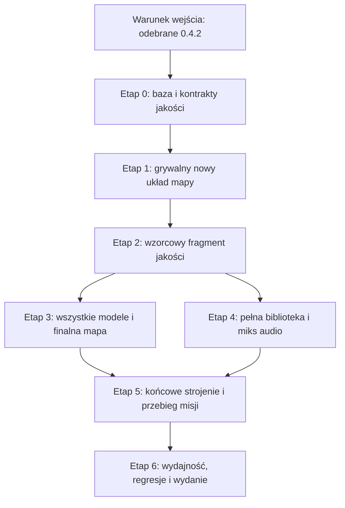

# Ziemia Niczyja 0.5.0 — plan dużego skoku jakościowego po 0.4.2

**Status: PLAN. Nie wykonano implementacji ani odbioru opisanych etapów.**

Aktualizacja: **6 września 2026**. Dokument zastępuje plan 0.5 z 5 września po
wydzieleniu napraw rozgrywki do [V0_4_2.md](V0_4_2.md).
Baza faktycznie odczytana w repo: `main`,
`fdf5c2ef41b8d097a187d22c0a2a22b3161a3c0f` (`v0.4.1`).
**Baza przyszłej implementacji 0.5: odebrane 0.4.2**, którego SHA i raport należy
wpisać po rzeczywistym wykonaniu tego wydania, nie przyjmować z góry.

Ten dokument określa projekt wydania, kolejność prac i warunki odbioru.
Nie zmienia kodu, numeru działającej gry, modeli, dźwięków ani opublikowanej strony.
Przeniesienie napraw do innego dokumentu nie oznacza, że zostały już wykonane.

## 1. Cel wydania i granice

0.5.0 ma zmienić Cambrai z grywalnego prototypu w spójną, dopracowaną misję FPS.
Po naprawczym 0.4.2 różnicę gracz powinien zobaczyć i usłyszeć od odprawy,
a odczuć podczas pierwszego przejścia przez przebudowane okopy i pole walki.

**Trzy obowiązkowe filary jakościowe 0.5:**

1. Przemodelowanie pozostałych zasobów przez **Blender MCP**, ruchome części pojazdów
   i broni oraz przebudowa postaci i animacji z poprawnym trzymaniem osobnej broni.
2. Zastąpienie proceduralnych odgłosów kompletnym zestawem realistycznego audio.
3. Przebudowa mapy, szczególnie połączeń okopów, wyjść, osłon i tras oddziału.

**Obowiązkowa podstawa, nie czwarty równoległy rewrite:** naprawy ruchu, trudności,
AI, misji, zapisu i cyklu życia z `V0_4_2.md`. W 0.5 trzeba zachować te wyniki,
zintegrować je z nowymi zasobami i powtórzyć odbiór. Końcowe strojenie walki na
nowej mapie pozostaje w tym wydaniu, lecz bazowa naprawa nie może na nie czekać.

**Przyjęty zakres:** nadal jedna misja Cambrai, rozbudowana jakościowo od początku
do końca. Nie dodajemy czterech pozostałych misji, multiplayera, nowego silnika,
pełnej symulacji pancerza ani fizyki każdego ogniwa gąsienicy. Nie wymieniamy
Babylon.js ani procesu budowania tylko po to, aby podnieść numer wersji.

Zachowujemy `Simulation` jako właściciela logiki, czasu, ruchu, obrażeń i zapisu.
Renderer i audio przedstawiają jej stan. Ustawienia jakości nie zmieniają obrażeń,
liczby wrogów, kolizji ani dostępnych dróg. Nadal publikujemy wyłącznie `dist/`.

Nie tworzyć branchy ani worktree, nie przełączać istniejących. Niniejszy plan nie
upoważnia do implementacji, zakupów zasobów, zmiany ustawień GitHub ani publikacji.
Podczas późniejszego wykonania wersję podnieść do `0.5.0` w etapie przygotowania
wydania; nie cofać żadnego numeru buildu.

## 2. Stan źródeł i podział odpowiedzialności

Poniższa inwentaryzacja pochodzi z bazy **0.4.1**, odczytanej również przy podziale
planu. Nie opisuje przyszłego stanu po naprawach 0.4.2. Etap 0 aktualizuje faktyczny
stan gameplayu, zachowując tę tabelę jako historyczne uzasadnienie zakresu.

| Obszar | Potwierdzony stan 0.4.1 | Właściciel zmiany po podziale |
|---|---|---|
| Piechota | `generate_characters.py` scala karabin z siatką ciała we wszystkich LOD-ach; eksporty 0.4.1 zachowały dawny kontrakt animacji | Samo przesunięcie karabinu nie rozwiąże problemu. Rozdzielić ciało i uzbrojenie oraz przeanimować chwyt i obsługę |
| Animacja | `render/view.js` przełącza pojedyncze klipy, obraca cały model do leżenia i nakłada stałe rotacje nóg przy kucaniu | Nowe klipy wymagają nowego sterowania pozą i usunięcia zastępczych korekt po odbiorze odpowiedników |
| Broń FPS | Ruch przeładowania i operowania bronią w dużej części zmienia transformację całego `fpRoot` | Potrzebne animacje dłoni, zamka, magazynka/bębna i poszczególnych faz obsługi |
| Czołgi | `trackPhase` istnieje, ale widoczna synchronizacja porusza głównie całym kadłubem; wyloty broni są liczbami w `tankMuzzle()` | Dodać rzeczywiste części modelu, ruch obu gąsienic i zgodne dane punktów strzału |
| Działo i samoloty | Renderer przesuwa cały model działa przy odrzucie; dokłada proceduralne śmigło do węzła modelu | Rozdzielić ruch lufy/oporopowrotnika i zastąpić dokładane części gotowymi eksportami |
| Audio | `audio/audio.js` buduje szum i oscylatory; pozycjonowanie wykorzystuje głównie dystans XZ i stereo | Wymienić bibliotekę dźwięków oraz sposób odtwarzania, miksowania i lokalizacji |
| Mapa | `TRENCHES`, `RAMPS`, przesunięcie `northZ`, heightfield i rozmieszczenie obiektów tworzą kilka powiązanych zestawów danych | Zaprojektować spójną sieć, z której wynikają geometria, kolizje, graf przejść i osłony |
| Kolizja | Ruch poziomy sprawdza zajętość w podkrokach; opadanie nie przechodzi przez taki sam pełny test bryły | Naprawa w 0.4.2. Jego niezależny skan odtworzył opadanie w belkę w fixture; dokładne zdarzenie użytkownika nadal wymaga własnej reprodukcji |
| Trudność | Redukcja obrażeń już istnieje: Rekrut 0,58; Żołnierz 0,82; Weteran 1,15 | 0.4.2 wdraża spójne profile; 0.5 dostraja je do nowej ekspozycji, bez drugiej redukcji |
| Trafienia | Gewehr ma 100 obrażeń, głowa ×1,6, zdrowie gracza 100 | Historyczne 131,2 HP w głowę na Żołnierzu; bazową naprawę rozstrzygania trafień przejmuje 0.4.2 |
| Regeneracja | `Health` rozpoczyna leczenie po 6 s bez obrażeń, po 12 HP/s | 0.4.2 naprawia profile i ich odbiór na starej mapie; 0.5 ponownie sprawdza dojście do nowych osłon |
| AI | Profil ognia przeciw graczowi jest inny niż NPC→NPC; automaty mogą strzelać w gracza z odstępem około 0,14 s | Podstawowe naprawy w 0.4.2; w 0.5 dalsze strojenie i współpraca na nowych trasach |

Źródła lokalne: `src/data/weapons.js`, `src/combat/health.js`,
`src/combat/ballistics.js`, `src/core/simulation.js`, `src/ai/soldier.js`,
`src/world/collision.js`, `src/world/terrain.js`, `src/data/cambrai.js`,
`src/render/view.js`, `src/render/support-view.js`, `src/audio/audio.js`.

Raport 0.4.1 podaje 134 testy i start Chromium na RTX 3060. To historyczny punkt
odniesienia, nie wynik 0.4.2 ani dowód ukończenia 0.5. Etap 0 korzysta z nowego,
rzeczywiście odebranego raportu 0.4.2 i powtarza potrzebne pomiary.

| Zakres wydzielony | Dokument wykonawczy | Obowiązek 0.5 |
|---|---|---|
| Płot, opadanie, penetracja, postawy, ustępowanie | `V0_4_2.md`, §4 i etapy 1–2 | Przeniesienie regresji i przejście nowych modułów kontrolerem gracza |
| Obrażenia, regeneracja, serie, reakcja i poprawność AI | `V0_4_2.md`, §5–6 i etapy 2–4 | Strojenie na finalnej mapie/audio bez duplikowania mechanizmów |
| Granaty, działo, warunki celów, terminalny stan misji | `V0_4_2.md`, §7 | Integracja nowych mocowań, efektów i rozmieszczenia przy tym samym kontrakcie logiki |
| Bezpieczny zapis, poprawność restore i walidacja | `V0_4_2.md`, §8 | Wersjonowanie nowej mapy i nowych danych authoringu |
| Fokus, późny wynik ładowania, przerwanie audio/akcji | `V0_4_2.md`, §9 | Regresja nowych loaderów, banku audio i adapterów animacji |

Rejestr niezależnego skanu, siła dowodów oraz odtworzone przypadki znajdują się
w `V0_4_2.md` §3 i §13. Nie kopiować ich do 0.5 jako kolejnej listy tych samych
napraw. Nie uruchamiać produkcji jakościowej na bazie, której P0/P1 tylko przeniesiono
na papierze do wcześniejszego wydania.

## 3. Podejście i kolejność zależności

Przyjęty podział wydań: **naprawa grywalności w 0.4.2 → przebudowa jakości w 0.5**.
Nie wybieramy podmiany wszystkich assetów przed naprawą podstaw ani jednoczesnego
pełnego rewrite gry. Zaktualizowany plan nie odkłada trudności i blokad do chwili,
gdy gotowe będą wszystkie modele.

Po odebraniu 0.4.2 najpierw powstaje uproszczona, grywalna nowa mapa. Następnie
krótki fragment łączący nowego żołnierza, broń, ruchomy Mark IV i prawdziwe dźwięki.
Dopiero gdy działa w grze, przenieść ten standard na wszystkie zasoby i sektory.
Końcowy balans wykonywać na finalnej geometrii osłon i po wdrożeniu sygnałów audio.

Etapy 3 i 4 mogą być wykonywane niezależnie po uzgodnieniu zdarzeń i animacji.
Regresje 0.4.2 obowiązują w każdym etapie, nie tylko przed wydaniem.
Odbiór etapu wymaga dowodów w działającej grze, jeżeli zmienia to, co gracz widzi
lub słyszy. Sam eksport, test jednostkowy albo screenshot Blendera nie wystarcza.

## 4. Modele i animacje: docelowy standard

### 4.1. Workflow Blender MCP

Źródło obecnych scen: `C:\Users\PC\Documents\GitHub\Blender\ZiemiaNiczyja`.
Scena piechoty: `blender/Infantry_Refined.blend`.

- [ ] Na starcie etapu sprawdzić połączenie i wersję dodatku MCP oraz aktywny plik.
  Nie modyfikować przypadkowej otwartej sceny ani niezapisanej pracy użytkownika.
- [ ] Modelować, ustawiać pivots, rigować i animować przez Blender MCP. Skrypty Python
  wykonywane przez MCP zachować w projekcie Blender, aby operacje były odtwarzalne.
- [ ] Dla każdej rodziny utrzymywać źródłowy `.blend`, kolekcje eksportowe, LOD-y,
  tekstury, ustawienia eksportu i podglądy. Nie traktować samego GLB jako źródła edycji.
- [ ] Eksportować najpierw do `staging/`; po walidacji importować kompletny zestaw
  do `public/assets/models/`, bez kopiowania scen i renderów do release.
- [ ] Uzgodnić skalę w metrach, osie eksportu, punkt podparcia, nazwy części i socketów.
  Sprawdzać eksport w Babylon.js, uwzględniając konwersję osi importera.
- [ ] Constrainty i IK Blendera wypiec do obsługiwanych klipów. Nie zakładać, że
  sterowniki, fizyka, Geometry Nodes albo animowane materiały automatycznie działają
  po eksporcie glTF. Dla danych ścieżek i punktów zaczepienia eksportować metadane [2].
- [ ] Aktualizować rejestr pochodzenia, skróty eksportów i generator/importer tak,
  żeby regeneracja nie przywracała starszych modeli.

### 4.2. Pełna lista produkcyjna

Przegląd obejmuje wszystkie widoczne rodziny zasobów obecnej misji, także geometrię
budowaną w JS. Poniższa lista stanowi minimum; etap 0 dopisuje do niej każde używane
`model ID` i rodzinę dekoracji. Żaden model nie znika z zakresu tylko dlatego, że
nie jest osobnym plikiem GLB.

| Rodzina | Zakres obowiązkowy | Ruch / interakcja |
|---|---|---|
| `british`, `british-v1`, `british-v2`, `german`, `german-v1`, `german-v2` | Anatomia, mundur, kontakt wyposażenia z ciałem, oddzielona broń, nowy zestaw poz i przejść | Chód, bieg, kucanie, leżenie, celowanie, ogień, przeładowanie, granat, melee, reakcja i śmierć |
| `smle`, `gewehr` | Proporcje, przyrządy, kolba, zamek, chwyt i mechanika zasilania | Cykl zamka, przeładowanie zgodne z przyjętym stanem magazynka, odrzut |
| `webley` | Szkielet broni łamanej, bęben, lufa, przyrządy | Otwieranie, wyrzut łusek, ładowanie i zamykanie |
| `lewis` | Magazynek talerzowy, lufa/osłona, dwójnóg i chwyty | Wymiana magazynka, obsługa zamka, odrzut |
| MG 08 | Osobny, prawidłowy wizualnie zestaw stanowiska; obecna deklaracja `model:'mg08'` nie ma własnego GLB w loaderze | Sektor celowania, odrzut i czytelna obsługa; strzelec nie trzyma wizualnie Gewehra |
| `hands` / zestawy pierwszoosobowe | Dłonie, palce, mankiety, poprawne nadgarstki i chwyty każdego używanego zestawu | Pełne animacje obsługi, zmiany broni, granatu i melee |
| `mark-iv` | Kadłub, gąsienice, podwozie widoczne z zewnątrz, sponsony, lufy, wydech | Obie gąsienice, obrót właściwych kół, celowanie i odrzut broni, widoczne uszkodzenia |
| `field-gun-77` | Koła, łoże, lufa, mechanizm odrzutu, zamek i stanowiska obsługi | Odrzut samego zespołu lufy, powrót, ładowanie, elewacja i dozwolony obrót |
| `dh5`, `dfw` | Poprawione sylwetki, skrzydła, podwozie, śmigło, miejsca podwieszeń | Własne śmigło, powierzchnie sterowe zgodne z lotem, widoczne zwolnienie bomby |
| Zasoby interakcji | Granat Mills, telefon, zapasy, apteczka i czytelne wyposażenie stanowisk | Poprawny punkt interakcji; ruch tylko tam, gdzie wynika z użytkowania |
| Otoczenie | Zestaw okopu, deski, worki, słupy i drut, płoty, schron, ruiny, skrzynie, stół/mapa/lampa | Moduły dopasowane do kolizji i terenu; zniszczenia tylko objęte logiką misji |

Materiały powinny czytelnie odróżniać tkaninę, skórę, drewno, stal, błoto i mokre
powierzchnie. Zużycie ma wynikać z krawędzi i kontaktu, a nie z jednakowego szumu
na całym modelu. Nie zwiększać rozdzielczości wszystkich atlasów bez potrzeby.

### 4.3. Żołnierz i broń jako współpracujące elementy

**Docelowo ciało żołnierza nie zawiera geometrii trzymanej broni.** Każdy LOD ciała
pozostaje bez karabinu. Broń dobierana jest z rzeczywistego `weapon.id`, a nie tylko
z frakcji lub wariantu wyglądu. Rozdzielenie dotyczy również dalekich LOD-ów.

Kontrakt do wdrożenia:

- Postać udostępnia stabilne punkty chwytu dłoni i odkładania/przenoszenia wyposażenia.
- Broń udostępnia `grip_primary`, `grip_support`, `muzzle`, `ejection` i osie ruchomych
  części. Nazwy są projektowanym kontraktem 0.5, nie istniejącymi dziś API.
- Główna dłoń steruje transformacją trzymanej broni; druga ma prawidłowy kontakt
  z jej chwytem w animacji. Na początku preferować wypieczone animacje per rodzina
  broni; ograniczone IK w runtime dodawać tylko tam, gdzie test wykaże potrzebę.
- Nie łączyć układu w cykl zależności: broń nie może jednocześnie sterować dłonią,
  która steruje bronią. Przeładowanie określa, która dłoń i który punkt są właścicielem
  kontaktu w danej fazie.
- Szkielet można zmienić lub rozszerzyć. Sztywne zachowanie 19 kości i bajtowo
  identycznych 13 klipów było kontraktem importu 0.4.1, nie ograniczeniem 0.5.0.
- Zachować czytelne mapowanie stanów gry na klipy. Ruch postaci pozostaje sterowany
  symulacją; animacje lokomocji bez przemieszczającego gracza root motion.
- Warstwy: lokomocja/postawa, górna część ciała i obsługa broni, kierunek celowania,
  krótkie reakcje. Zdefiniować priorytety oraz przerwania: śmierć, granat, reload,
  zmiana broni, utrata celu. Ustalić dozwolone kombinacje zamiast mnożyć martwe klipy.
- Usunąć zastępcze obracanie całego ciała do prone oraz stałe korekty nóg dopiero
  po wdrożeniu i odbiorze odpowiednich animacji; nie nakładać obu systemów naraz.

Obowiązkowe próby: rifle/automatic/sidearm dla używanych postaci i zestawów FPS;
stanie, kucanie i leżenie; ruch i zatrzymanie; celowanie w górę/dół; ogień;
reload pełny/częściowy, jeżeli rozróżnia go logika; przerwanie reloadu; zmiana broni;
granat; śmierć. Stanowisko MG i artylerzyści otrzymują pozy obsługi.

Warunki odbioru:

- Brak karabinu przechodzącego przez klatkę i brak drugiej, ukrytej kopii broni.
- Kolba, obie dłonie i palec wskazujący pozostają wiarygodnie ustawione w kluczowych
  momentach i przejściach. Odbiór obejmuje ogląd całych klipów, nie tylko pięć klatek.
- Wylot efektu, dźwięk wystrzału i kierunek pocisku są spójne z widoczną bronią.
  Gameplay nie pobiera trafień z opóźnionej klatki renderera.
- Przy zmianie LOD broń nie znika, nie podwaja się i nie zmienia miejsca w dłoniach.
- Fazy animacji i dźwięków korzystają z czasu symulacji i tej samej osi czasu obsługi
  broni; próbkowanie renderu nie zużywa amunicji i nie wywołuje kolejnego strzału.
- Na nierównym terenie stopy nie ślizgają się stale i nie wiszą; najpierw poprawić
  klipy, tempo lokomocji i podparcie, potem rozważać ograniczone dopasowanie stóp.

### 4.4. Gąsienice i części mechaniczne

Mark IV wymaga widocznego ruchu obu pasów, a nie kołysania kadłuba udającego napęd.
Rekomendacja: w Blenderze przygotować ogniwo oraz zamknięte ścieżki obu gąsienic;
wyeksportować próbki ścieżek i widoczne elementy. Blisko gracza odtwarzać ogniwa
jako instancje. Nie tworzyć osobnego materiału i draw calla na każde ogniwo.

Faza lewego i prawego pasa wynika z **rzeczywiście przebytej drogi i zmiany yaw**,
z uwzględnieniem rozstawu gąsienic. Nie z zamiaru ruchu ani czasu ściennego.
Stanie przed przeszkodą, pauza, cofanie, skręt i unieruchomienie muszą dawać zgodny ruch.
Daleki LOD może korzystać z uproszczonego pasa i animacji UV, pod warunkiem zgodnej fazy.
Blenderowe modyfikatory ścieżki nie są zależnością działającej gry.

Dla sponsonów, zamka, luf i sterów eksportować lokalne osie, pivots, limity i sockety.
Mark IV zachowuje układ sponsonów; nie dodajemy współczesnej obrotowej wieży.
Stan działa i amunicji pochodzi z symulacji. Parametry strzału i render korzystają
ze wspólnych metadanych mocowań, bez dwóch ręcznie utrzymywanych kompletów offsetów.

Testy: jazda prosto, oba skręty, zatrzymanie przez NPC, cofanie w scenie kontrolnej,
uszkodzenie gąsienicy, uszkodzenie uzbrojenia, wystrzał w skrajach sektora, pauza,
checkpoint i ponowny start. Dla samolotów również zrzut bomby z widocznego mocowania.

## 5. Realistyczne audio

### 5.1. Zawartość biblioteki

Obecne szumy i oscylatory przestają być właściwymi odgłosami broni, silników, kroków
i wybuchów. Podstawą będą nagrania lub przygotowane z nagrań efekty o rozpoznawalnym
ataku, mechanice i wybrzmieniu. Źródła oraz prawa do dystrybucji sprawdzić przed importem;
nie używać dźwięków wyciągniętych z CoD2. Zakup płatnej biblioteki wymaga osobnej decyzji.

| Grupa | Wymagany zakres |
|---|---|
| Broń ręczna i MG | Osobne charaktery SMLE, Gewehr, Webley, Lewis i MG; warianty strzału, wybrzmienia blisko/daleko, mechanika, reload i pusty magazynek |
| Pociski | Przelot blisko gracza powiązany z rzeczywistym strzałem, rykoszet tam, gdzie wynika z modelu zdarzeń, uderzenia w drewno/ziemię/metal/mur |
| Wybuchy | Granat, pocisk działa i bomba; uderzenie, niski impuls, odłamki/gruz i ogon; dystans, kierunek i osłona |
| Ruch | Kroki na ziemi, błocie, deskach i gruzie, bieg, lądowanie, czołganie, szelest wyposażenia |
| Pojazdy | Silnik Mark IV, obciążenie, gąsienice i skrzypienie; silniki samolotów i przelot; mechanika i strzał działa |
| Postać | Oddech wysiłkowy, sygnał poważnych obrażeń, krótkie reakcje; bez ciągłego zagłuszającego dyszenia |
| Świat | Wiatr, daleki front, wnętrze schronu, otwarty teren, ruiny; ciągłe, niepozornie zapętlone tło |
| Interakcje i komunikaty | Gwizdek, telefon, amunicja, przełączniki/zamek, UI; czytelna hierarchia komunikatów |

Próbki powtarzalne: początkowo minimum 4 warianty strzałów i 6 kroków na powierzchnię,
bez bezpośredniego powtarzania tej samej próbki. Ostateczne liczby wynikają z odsłuchu
i budżetu, nie z mechanicznego mnożenia plików. Ciągłe odgłosy pojazdów mają warstwy
i płynne przejścia, nie serię niezależnych piknięć co 0,2 sekundy.

Krótkie nagrane okrzyki oddziału i ostrzeżenia proponuję w zakresie wydania.
Pełny dubbing odprawy jest rozszerzeniem po odbiorze efektów; napisy i istniejąca
możliwość pominięcia pozostają działające. Dostępność aktorów/głosów nie blokuje
naprawy broni, kroków, pojazdów i wybuchów.

### 5.2. Odtwarzanie, synchronizacja i miks

- Oddzielić bank plików, routing/miks oraz obsługę zdarzeń, utrzymując małe moduły
  w `src/audio/`. Nazwy proponowane: `bank.js`, `mixer.js`, `audio.js`.
- Krótkie efekty dekodować raz do współdzielonych buforów. Nowe źródło odtwarzania
  tworzyć dla konkretnego dźwięku; `AudioBufferSourceNode` nie jest wielorazowym
  odtwarzaczem [3]. Bufory mają kontrolowany czas życia i limit pamięci.
- Długich ambientów nie ładować bezwarunkowo w całości jako PCM. Wybrać krótkie
  zapętlane warstwy albo odtwarzanie strumieniowe; zweryfikować pauzę i wznowienie.
- Kanały: master, broń/efekty, pojazdy, tło, głosy, interfejs. Osobne odgłosy własnej
  broni i świata; nie mnożyć drugi raz głośności tła przez suwak efektów.
- Pozycjonowanie uwzględnia XYZ i orientację gracza, szczególnie samoloty i wybuchy.
  Drogie pozycjonowanie ograniczyć do najważniejszych źródeł; resztę upraszczać.
- Osłonięcie i pogłos wynikają z geometrii/stref schronu, okopu i otwartej przestrzeni.
  Aktualizować ograniczoną liczbę źródeł z mniejszą częstotliwością, nie każdy głos
  każdym raycastem w każdej klatce. Brak pełnej symulacji propagacji dźwięku.
- Ograniczyć liczbę głosów z priorytetami. Ostrzeżenie, własny strzał i pobliski
  przeciwnik nie przegrywają z dekoracyjnym ambientem. Zwalniać źródła i węzły.
- Zdarzenia mają ID właściciela, typ, pozycję, czas symulacji i wariant/material.
  Fazy reloadu, zamka i kroku wynikają z osi czasu akcji. Zdarzenia przekroczone
  pomiędzy dwiema próbkami wykonać raz; checkpoint i przewinięcie nie odtwarzają historii.
- Po pauzie, blur, zmianie misji i błędzie ładowania nie pozostają silniki ani echo
  dawnych strzałów. Wznowienie nie odgrywa kolejki zaległych efektów.
- OGG/MP3 lub inne wybrane warianty potwierdzić realnym dekodowaniem w docelowych
  przeglądarkach. Rozszerzyć MIME serwera i walidację zasobów. Pliki muszą działać
  z względnego podkatalogu Pages, bez zewnętrznego serwera audio.

Masters, projekt miksu, manifest i licencje zachować w źródłach authoringu, poza
publikowanym `dist/`. Dla audio ustalić w etapie 0 wersjonowaną lokalizację, np.
`authoring/audio/`, i rozmiar plików; nie powtarzać wzorca jedynej kopii źródeł
w ignorowanym katalogu. Gra przechowuje gotowe próbki w `public/assets/audio/`.

Odbiór: odsłuch na słuchawkach i głośnikach, próbki solo oraz pełna bitwa, trzy
odległości i różne osłony. Broń i źródło zagrożenia muszą być rozpoznawalne.
Brak klików pętli, cyfrowego przesteru, nadmiernych skoków głośności i przeciekających
głosów. Wynik wymaga odsłuchu przez człowieka; analiza widma nie zastępuje realizmu.

## 6. Mapa: logiczne okopy i grywalne sektory

### 6.1. Układ funkcjonalny

Zaprojektować od nowa sieć własnych okopów i przejść przez zdobywane pozycje.
Nie łączyć obu przeciwnych frontów jednym bezpiecznym tunelem: ziemia niczyja
pozostaje niebezpiecznym odcinkiem, który można pokonać z planem i osłoną.

| Sektor | Funkcja i wymagane połączenia |
|---|---|
| Dowodzenie i zaplecze | Odprawa → szerokie wyjście → okop komunikacyjny → własna linia. Oddział nie blokuje drzwi |
| Własna linia | Poprzeczne odcinki, trawersy, stanowiska i rozpoznawalne rampy wyjścia; dojście z zaplecza bez skoków |
| Ziemia niczyja | Główne podejście ze wsparciem czołgów i boczna droga piechoty przez obniżenia/leje; oba czytelne |
| Pierwsza linia przeciwnika | Po wejściu możliwość poruszania się okopem i oskrzydlenia MG; poprawne skrzyżowania i dojścia do stanowisk |
| Łącznik i punkt sanitarny | Ciągła droga w obrębie zdobytych pozycji, punkt oddechu i bezpieczny zapis |
| Działo i zabudowania | Co najmniej dwa taktycznie różne podejścia; zniszczenie czołgów nie zamyka trasy piechoty |
| Telefon i obrona | Czytelne wejścia, osłony i kierunki kontrataku; wróg nie musi stać w niewidzialnym punkcie, aby zablokować finał |

Wstępne założenia wymiarowe do sprawdzenia w uproszczonej mapie: główne okopy
około 1,6–2,0 m wolnej szerokości; węższe odcinki tylko z miejscem mijania lub
jednoznacznym ruchem jednokierunkowym oddziału. Rampy docelowo do około 30°.
Wysokość prześwitu uwzględnia sylwetkę, margines kolizji i animację głowy.
Wymiary liczyć po dodaniu desek/worków, a nie pomiędzy samymi osiami rowu.

### 6.2. Jedna definicja przestrzeni

Proponowany `src/data/trench-network.js` definiuje węzły i krawędzie sieci:
ID, pozycję, szerokość, wysokość dna, profil skarp, rodzaj połączenia i wejście/wyjście.
To źródło dla terenu, modułów wykończenia, colliderów, nawigacji i rozmieszczenia osłon.
Nie tworzyć drugiego grafu, którego drożność nie wynika z faktycznej przestrzeni.

- [ ] Zastąpić sumowanie niezależnych polilinii i wyjątków świadomymi skrzyżowaniami,
  narożnikami, zakończeniami i rampami w dowolnym kierunku.
- [ ] Łączyć powierzchnie dna i skarp bez garbów, szczelin, przecinających się ścianek
  i dodatkowych colliderów poprzecznych w przejściu.
- [ ] Zachować zgodność powierzchni renderowanej, podparcia, pocisków i wzroku AI.
  Dokładniejszą siatkę wprowadzić tylko tam, gdzie test wykaże zbyt grubą rozdzielczość.
- [ ] Elementy z Blendera pełnią rolę modułów wykończenia i rekwizytów; nie konkurują
  z niezależnym heightfieldem o definicję podłogi i kolizji.
- [ ] Po zmianie mapy zaktualizować razem: cele, spawn, obsadę, osłony AI, trasy
  czołgów, strefy nalotów, punkty interakcji, mapkę odprawy i znaczniki.
- [ ] Każdy ważny cel osiągalny przez normalny kontroler gracza, również bez żywego
  czołgu. Przejście botem po samych węzłach grafu nie jest wystarczającym testem.

Czytelność: różne sylwetki sektorów, materiały zgodne z funkcją, widoczne wejścia
i punkty orientacyjne. Światło powinno pokazywać twarze, ukształtowanie osłon i drogę;
nie maskować słabych modeli ciemnością, bloomem lub nadmiarem mgły.

## 7. Ruch i kolizje: integracja odebranego 0.4.2

**Bazowa naprawa płotu, opadania i zakleszczeń została wydzielona do `V0_4_2.md`.**
Słowo „wydzielona” nie oznacza „wdrożona”: warunkiem wejścia jest rzeczywisty odbiór
wcześniejszego wydania. 0.5 nie tworzy drugiego kontrolera ani drugiej ścieżki
awaryjnego teleportowania postaci.

- [ ] Przenieść komplet testów i fixture'ów 0.4.2 oraz raport reprodukcji płotu.
  Nie wycinać testu starego obiektu tylko dlatego, że nowa mapa go przesunęła.
- [ ] Dla każdej nowej rodziny modułów określić blokowanie ruchu/pocisków, podparcie,
  możliwość wejścia na stopień i zgodną bryłę wszystkich postaw.
- [ ] Sprawdzić pełną trajektorię na nowych rampach, skrzyżowaniach, belkach, wejściach
  schronów i wokół pojazdów. Powierzchnia widoczna, podparcie oraz test wzroku/pocisku
  muszą pochodzić ze zgodnej definicji przestrzeni.
- [ ] Powtórzyć wejścia prostopadłe/ukośne, narożniki, skok/lądowanie, skarpę, płot
  nad rowem, obrót prone, cofanie, sprint, NPC/czołg, pauzę i load.
- [ ] Powtórzyć 30/60/120/144 FPS renderu i opóźnione klatki przy stałym kroku logiki.
  Kontrolować liczbę korekt awaryjnych, nie tylko brak widocznego utknięcia.
- [ ] Nowe spawn/checkpointy przechodzą walidację przestrzeni i bezpieczeństwa z 0.4.2.
  Punkt zablokowany przez finalny moduł nie zostaje „naprawiony” wyłączeniem kolizji.
- [ ] Kontakty postaci, nowej broni i pojazdów nie przejmują sterowania gameplayem
  od symulacji. Animacja lokomocji nadal nie ma przenoszącego gracza root motion.

Testy 0.5 obejmują **nową integrację i geometrię**. Jeżeli powraca wcześniejszy błąd,
jest to regresja blokująca wydanie, a nie powód do uznania dawnych testów za nieaktualne.
Nie rozwiązywać problemu ruchem przez ścianę, zmniejszeniem bryły gracza na niskiej
jakości albo dalszym odsuwaniem odbioru do następnego wydania.

## 8. Trudność: końcowe strojenie po zmianie mapy i audio

### 8.1. Zachowany kierunek projektu

Oficjalna instrukcja PC CoD2 opisuje kierunkową informację o trafieniu, oddech/tętno
i zaburzenie obrazu przy zagrożeniu oraz odzyskanie zdrowia po odpoczynku bez kolejnych
obrażeń [1, s. 5]. Z tego wynika kierunek projektu: gracz rozpoznaje zagrożenie,
dociera do osłony, odzyskuje kontrolę i ponownie podejmuje walkę.

Instrukcja nie podaje ukrytych mnożników, dokładnych timerów ani reguł ochrony
przed serią trafień. Parametry Ziemi Niczyjej są decyzjami projektu, nie potwierdzonym
odtworzeniem kodu CoD2. Odnośnik i opis referencji zachowano z pierwotnego planu.

### 8.2. Co odziedziczyć, a co dostroić

Profile startowe, kontekst obrażeń, poprawność regeneracji, podstawowe serie,
reakcje i widoczność AI są teraz opisane w `V0_4_2.md` §5–6. **Nie wprowadzać ich
ponownie w 0.5.** Punktem startu są faktycznie przyjęte wartości odebranego 0.4.2,
nie bezwarunkowe przywrócenie propozycji tabeli sprzed jego playtestów.

0.5 zmienia przestrzeń, osłony, trasy i czytelność zagrożenia. Dlatego wcześniejszy
odbiór nie wystarcza do stwierdzenia, że nowa misja ma dobry balans.

- [ ] Strojenie wykonywać dla Rekruta, Żołnierza i Weterana, z głównym odbiorem
  na Żołnierzu. Nie podnosić HP przeciwników i nie osłabiać obrażeń gracza przy okazji.
- [ ] Mierzyć dystans i czas do osłony na nowych podejściach, liczbę kierunków ognia,
  gotowość wrogów, serie/przerwy i możliwość powrotu po regeneracji.
- [ ] Przerwy kilku strzelców i współpraca oddziału mają tworzyć czytelny rytm;
  nie dodawać magicznego limitu przeciwników uprawnionych do zadania obrażeń.
- [ ] Sprawdzić widoczną część sylwetki i fizyczny wylot po zmianie modeli oraz osłon.
  Nie wyłączać muzzle check tylko dlatego, że nowa animacja lub socket jest błędny.
- [ ] Usunąć niesprawiedliwe ekspozycje wynikające z nowego projektu starć oraz
  checkpointy bez szansy kontynuacji, korzystając z kontraktów 0.4.2.
- [ ] Nowe audio i efekty obrażeń informują o kierunku/pilności bez zasłaniania celu
  całym czerwonym ekranem. Intensywność i głośność pozostają regulowane.
- [ ] Zachować apteczki jako ułatwienie tempa, nie wymóg przeżycia każdej wymiany.
  Ich usunięcie byłoby osobną decyzją, a nie warunkiem inspiracji CoD2.
- [ ] Opisy trudności i regeneracji nadal czerpią wartości z efektywnego profilu,
  również po wczytaniu checkpointu. Nie powracają sztywne historyczne 6 s.

### 8.3. Odbiór nowej misji

Scenariusze kontrolowane pozostają: strzelec w 15/35/60 m, jeden MG,
3–5 przeciwników z dwóch kierunków, bieg do osłony, odsłonięcie po regeneracji,
granat za osłoną i obok niej oraz świeży checkpoint. Scenariusze AI wykonać na
co najmniej **30 seedach na profil**, na nowej geometrii i finalnych sygnałach audio.

Rejestrować czas do pierwszego trafienia, obrażenia w oknach 0,25/1/3 s, źródła i
części ciała, liczbę aktywnych strzelców, czas do śmierci, dystans do osłony oraz
czas bezpiecznego odzyskania HP. Nie wyciągać wniosku o całej trudności z jednego strzału.

W standardowym pierwszym starciu na Żołnierzu zachować cel około **1,5–3 s** na
rozpoznanie zagrożenia i schowanie się, mierzone od wykrycia. To cel projektu
starcia, nie gwarantowana nieśmiertelność. Długie stanie na otwartym nadal przegrywa.

Odbiór ludzki: co najmniej 3 osoby o różnej znajomości FPS, minimum jedno pełne
przejście na osobę i powtórzenie trudnego sektora. Zapisać trudność, zgony, miejsce,
przyczynę i czytelność zagrożenia. Osobno ocenić wariant bez żywych czołgów.
Bot z wiedzą o całej mapie dowodzi przechodniości, nie jakości balansu.
Wynik porównać z odebranym 0.4.2; historyczne 0.4.1 może pozostać dodatkowym odniesieniem.

## 9. Dodatkowe propozycje i granica względem patcha

### W zakresie głównym 0.5

1. **Oddział, który współpracuje:** zajmowanie osłon zgodnych z nową mapą, czytelne
   sygnały ruchu, wsparcie i flanki. Podstawowe ustępowanie oraz spójność rezerwacji
   są zależnością z 0.4.2; nie zaczynać od ponownego rozwiązywania blokowania drzwi.
2. **Lepsza odpowiedź broni:** odrzut ruchomych części, błysk i drobny dym z wylotu,
   uderzenia zależne od materiału, wyraźne potwierdzenie trafienia z oszczędną oprawą.
3. **Rytm misji:** odprawa, napięcie przed wyjściem, intensywny sektor, krótki odpoczynek,
   oskrzydlenie i obrona. Dopracować obecną misję zamiast dodawać cele „dotknij punktu”.
4. **Checkpointy dostosowane do nowej mapy:** użyć mechanizmu bezpieczeństwa i szybkiej
   ponownej próby z 0.4.2, wybrać właściwe miejsca odpoczynku i sprawdzić nowe zagrożenia.
5. **Kontrola czytelności:** twarze widoczne w odprawie, sylwetki na tle okopów, wejścia
   i kierunek ataku. Jednolita kolorystyka oraz skala zabrudzeń i materiałów.

### Po spełnieniu głównych kryteriów

- Krótki pełny dubbing istniejącej odprawy i dodatkowe reakcje oddziału.
- Drobne animacje środowiska i wyposażenia, które nie zwiększają liczby przeszkód.
- Bardziej szczegółowe dopasowanie stóp/terenu i kontaktu gąsienic z podłożem.

Nie rozszerzać 0.5.0 o dowolną destrukcję, ragdoll każdej postaci, walki powietrzne,
sterowanie pojazdami ani przebudowę całego menu. Dodatki opcjonalne nie zastępują
pełnej produkcji modeli, audio i mapy ani zachowania napraw wcześniejszego wydania.

## 10. Budżety i zgodność techniczna

To **proponowane limity projektowe**, do zatwierdzenia pomiarami etapu 0/2:

| Element | Punkt startowy |
|---|---|
| Piechur z trzymaną bronią, LOD0/1/2 | do około 30k / 10k / 3k trójkątów łącznie |
| Zestaw dłonie + broń FPS | do około 35k; priorytet miejsc widocznych z kamery |
| Mark IV LOD0/1/2 | około 55k / 20k / 7k, z osobnym raportem kosztu ogniw |
| Działo / samolot LOD0 | około 20k / 25k; dalekie warianty znacznie tańsze |
| Materiały postaci | zwykle 2–3 widoczne prymitywy z bronią; raport draw calls zamiast wymuszania dawnego scalania |
| Audio | do 48 słyszalnych głosów; początkowo do 12 źródeł z kosztownym pozycjonowaniem |
| PCM efektów audio | do około 96 MiB aktywnego banku; osobno policzyć strumienie, kopie i bufory |
| Pliki audio dostarczane do przeglądarki | początkowy cel do 30 MiB, preload tylko niezbędnego zestawu |
| Cały release | cel do około 100 MiB; jawny podział modele/tekstury/audio/runtime |

Przykład kosztu pamięci: 60 s stereo, 48 kHz, float32 to około 22 MiB samego PCM.
Mały skompresowany plik nie oznacza małego zużycia RAM po dekodowaniu [3].

Docelowa próba użytkowa: 1080p/Medium na RTX 3060, minimum komfortowa płynność
w okolicach 60 FPS, bez regularnych przycięć podczas strzału, zbliżenia czołgu i nalotu.
CPU, sterownik, ustawienia, limit FPS i rozdzielczość zapisać w każdym pomiarze.
Cel należy zweryfikować, nie przedstawiać go jako już osiągnięty.

Pomiary rozdzielić:

1. Izolowany koszt modeli/animacji/audio na tej samej scenie i trasie, stały seed,
   ustawienia, rozgrzanie, co najmniej 3 powtórzenia. Porównanie z odebranym 0.4.2; 0.4.1 tylko jako dodatkowa historyczna baza.
2. Cała przebudowana misja: stałe scenariusze odprawy, natarcia, czołgów, działa i
   finału. Zmieniona mapa nie jest kontrolowanym A/B samego renderera.

Raportować medianę i p95/p99 czasu klatki, 1%/0,1% low, CPU symulacji i renderu,
GPU, czas ładowania/dekodowania, szczyt pamięci, liczbę głosów i draw calls.
Brak GPU query oznaczać jako brak pomiaru. Nie sumować nachodzących na siebie metryk.
Przekroczenie budżetu naprawiać LOD-em, cullingiem, liczbą głosów lub danymi;
nie ratować wyniku usuwaniem przeciwników na niskiej jakości.

## 11. Zapis, import i utrzymanie

### 11.1. Nowa mapa po zgodnym patchu 0.4.2

0.4.2 ma zachować istniejącą mapę oraz obsługę poprawnych checkpointów 0.4.1.
**Dopiero przebudowa przestrzeni w 0.5 zmienia wersję misji.** Odczytana baza ma
`MISSION_VERSION=3`; przy niezmienionej wartości po 0.4.2 podnieść ją w etapie 1 do 4.
Jeśli faktyczna baza okaże się inna, przyjąć kolejną właściwą wersję, nigdy nie cofać numeru.

Domyślnie checkpointy **0.4.x nie są przenoszone pozycyjnie do nowej mapy 0.5**.
Stary zapis wykrywać czytelnie, zachowując ustawienia i klawisze. Nie wczytywać
postaci do ściany, niewłaściwego sektora lub złej fazy misji.
`SAVE_VERSION` zmieniać tylko przy rzeczywistej zmianie formatu; odczytać stan
odebranego 0.4.2, nie zakładać, że numer schematu i numer misji są tym samym.

Zapisy 0.5 przechowują stan gameplayu potrzebny do kontynuacji: postęp, HP i timery,
przeładowanie, broń, AI, pojazdy, uszkodzenia i przejścia. Nowe pola mają walidację
i świadome wartości domyślne. Obowiązują naprawy bezpieczeństwa i spójności z 0.4.2:
aktualne zamiary AI, osłony, stan działa, poprawny punkt spawnu i jeden stan terminalny.
Nie serializować obiektów renderera ani referencji źródeł audio.

Audio i scena odtwarzają bieżący stan bez historycznych one-shotów. Przejście przez
checkpoint nie tworzy drugiego strzału, nowego przeładowania ani duplikatu samolotu.
Nowe kontrakty animacji/banku muszą zachować identyfikację oraz anulowanie akcji,
które zaakceptowano w 0.4.2, zamiast ponownie wprowadzać własny niespójny zegar.

### 11.2. Authoring i importy

Nie utrzymywać dwóch właścicieli geometrii: stare generatory modeli zastąpionych
przez Blender stają się narzędziami historycznymi, a standardowa regeneracja zachowuje
wszystkie importy. Dotyczy to pojazdów i broni, nie tylko obecnej ochrony sześciu GLB.
Manifest ma wskazywać komplet plików, źródło, wersję kontraktu i skróty; nie pozwala
wydać nowego GLB ze starymi teksturami albo samym starym adapterem runtime.

## 12. Etapy wykonania

Wszystkie pola pozostają otwarte. Przed etapem 0 wymagany jest rzeczywisty odbiór
0.4.2 zgodnie z jego dokumentem, nie samo istnienie pliku `V0_4_2.md`.
Każdy etap kończy się grywalnym, sprawdzonym wynikiem przed rozpoczęciem zależnych prac.

### Etap 0 — odebrana baza i kontrakty jakości

Pliki do odczytu: raport/changelog i testy 0.4.2, bieżące `docs/`, `src/`, `tools/`,
manifesty assetów i sceny Blender. Dowody: `.local/v0.5-tests/baseline/`;
trwałe zestawienie w dokumentacji.

- [ ] Potwierdzić checkout, SHA odebranego 0.4.2, wersje narzędzi, build i połączenie MCP.
  Przy brakującym odbiorze wrócić do zależności, nie ogłaszać rozpoczętej naprawy w 0.5.
- [ ] Uruchomić jego regresje kolizji, AI, obrażeń, misji, zapisu i lifecycle.
- [ ] Wykonać inwentaryzację wszystkich modeli, dekoracji, dźwięków i powiązań runtime.
- [ ] Zapisać bazowe przejście, chwyt broni, wygląd pojazdów/audio i pomiary 0.4.2.
- [ ] Uzgodnić kontrakty socketów, części, animacji, audio, kolizji i lokalizację masters.
  Nowe kontrakty nie zastępują własności czasu/stanu z naprawczego wydania.
- [ ] Ustalić scenariusze porównawcze, katalog dowodów i budżety wzorcowej próbki.

Odbiór: żadna rodzina zasobów nie pozostaje bez zakresu i sposobu weryfikacji;
wszystkie przeniesione naprawy mają dowód z bazy, a nie tylko odnośnik do planu.

### Etap 1 — uproszczona, grywalna nowa mapa

Pliki: `src/data/cambrai.js`, `src/data/world-map.js`, proponowany
`src/data/trench-network.js`, `src/world/terrain.js`, `src/world/layout.js`,
`src/ai/navigation.js`, `src/missions/director.js`, `src/save/schema.js`.
Testy planowane: `tests/v05-map.test.mjs`, integracyjne `tests/v05-collision.test.mjs`
i testy wersji misji; komplet regresji 0.4.2 pozostaje uruchamiany.

- [ ] Zbudować nową sieć i zrozumiały blokout całej misji z tymczasowych brył według §6.
- [ ] Zaktualizować razem nawigację, cele, obsadę, osłony, trasy wsparcia i wersję misji.
- [ ] Każde połączenie przejść rzeczywistym kontrolerem gracza, nie tylko węzłami grafu.
- [ ] Wykonać przejście od początku do końca, również bez żywych czołgów.
- [ ] Zachować przyjęte profile 0.4.2 jako punkt startowy. Zmierzyć okno reakcji i czas
  do osłony na nowej geometrii; nie implementować od nowa systemu obrażeń/reakcji.
- [ ] Odrzucić stare checkpointy pozycyjne zgodnie z §11, bez utraty ustawień.

Odbiór: cała misja przechodnia, okopy rzeczywiście połączone, sensowna pierwsza
wymiana ognia. Nie zaczynać szczegółowego dekorowania nieodebranej geometrii.

### Etap 2 — wzorcowy fragment jakości

Blender: jedna postać brytyjska, SMLE i dłonie FPS, Mark IV z napędem, moduł okopu.
Runtime: `src/render/assets.js`, `src/render/view.js`, `src/vehicles/tank.js`,
`src/audio/audio.js`; proponowane `src/render/character-animation.js`,
`src/render/weapon-view.js`, `src/render/vehicle-animation.js` oraz bank audio.

- [ ] Przez MCP przygotować ciało bez broni, sockety i nowe klipy SMLE/stania/kucania.
- [ ] Połączyć osobną broń i dłonie, zdarzenia cyklu strzału/reloadu oraz efekty wylotu.
- [ ] Uruchomić rzeczywisty ruch obu gąsienic i mechanikę strzału Mark IV.
- [ ] Dodać finalny jakościowo komplet: SMLE, kroki, wybuch i silnik/gąsienice.
- [ ] Przejść 60–90 s wzorcowego fragmentu w grze, z pauzą, przerwaniem akcji,
  checkpointem i zmianami LOD. Nie zużywać amunicji z callbacku renderu/animacji.
- [ ] Obejrzeć pełne klipy, odsłuchać próbkę i zmierzyć koszt. Poprawić kontrakt
  przed produkcją wszystkich wariantów, zachowując regresje 0.4.2.

Odbiór: widoczna i słyszalna różnica względem 0.4.2, bez karabinu w torsie,
nieruchomych gąsienic i regresji sterowania. To obowiązkowa próba połączenia systemów.

### Etap 3 — produkcja wszystkich modeli i finalne wykończenie mapy

Blender: pełna macierz §4.2. Runtime: adaptery animacji, `support-view.js`,
`landscape.js`, `layout.js`, `assets.js`, `field-gun.js`, `air-support.js`, dane interakcji.
Testy planowane: `tests/v05-assets.test.mjs`, `tests/v05-animation.test.mjs`.

- [ ] Dokończyć sześć postaci, wszystkie rodziny broni, stany obsługi i przejścia.
- [ ] Dokończyć działo, oba samoloty, rekwizyty interakcji i cały zestaw otoczenia.
- [ ] Zastąpić pomocnicze proceduralne części gotowymi eksportami; nie renderować obu kopii.
- [ ] Ujednolicić materiały, teren, oświetlenie i dekoracje wszystkich sektorów.
- [ ] Powtórzyć przechodniość po każdym wstawieniu finalnego modułu, z aktualną
  szerokością przejść; nie przyjmować szerokości sprzed dodania desek/worków.
- [ ] Odebrać wszystkie LOD-y, sockety, mechanikę, kolizje i pochodzenie zasobów.
- [ ] Nowy model działa odtwarza przyjęty w 0.4.2 stan obsługi/neutralizacji.
  Nowe mocowania nie mogą przywrócić ostrzału już trwale uciszonego celu.

Odbiór: pełna macierz ma gotowy eksport i dowód w grze. Nie zamykać etapu na podstawie
jednego ładnego żołnierza albo czołgu pokazowego.

### Etap 4 — pełne audio

Pliki: `src/audio/`, zdarzenia w `src/core/`, `src/combat/`, `src/vehicles/`,
`src/ui/ui.js`, `src/save/store.js`, `tools/serve.mjs`, `tools/check.mjs`;
zasoby `public/assets/audio/`, manifest authoringu i `ASSET_LICENSES.md`.
Testy planowane: `tests/v05-audio.test.mjs`, próby przeglądarkowe i odsłuchowe.

- [ ] Przygotować, opisać i zaimportować całą bibliotekę §5.1.
- [ ] Wdrożyć miks, limity głosów, przestrzeń, warstwy pojazdów i strefy akustyczne.
- [ ] Zsynchronizować zdarzenia z animacją i logiką; obsłużyć brak pliku/dekodera.
- [ ] Zachować z 0.4.2 anulowanie/własność aktywnej operacji i poprawność pauzy.
  Nowy bank nie dostaje oddzielnego zegara gameplayu ani własnego zużycia amunicji.
- [ ] Sprawdzić pauzę, przerwanie loadu/reloadu, powrót do menu, późny wynik ładowania
  starej misji i ponowne wejścia bez wycieku albo odgrywania historii.
- [ ] Przeprowadzić odsłuch pełnej bitwy i ustawić finalne poziomy/dynamikę.

Odbiór: każda obowiązkowa grupa zastąpiona i czytelna w miksie; brak przypadkowej
pozostałości dawnych tonów jako właściwego odgłosu broni czy silnika.

### Etap 5 — końcowe strojenie, współpraca i rytm nowej misji

Pliki: istniejące profile trudności, `src/ai/soldier.js`, `src/ai/navigation.js`,
`src/missions/director.js`, `src/combat/`, `src/save/`, teksty odprawy/ustawień/śmierci
oraz warstwa sygnalizacji obrażeń. Osobny `src/ui/damage-feedback.js` pozostaje
propozycją organizacji kodu, nie założeniem, że taki moduł już istnieje.
Test planowany: `tests/v05-difficulty.test.mjs`; regresje 0.4.2 nadal obowiązują.

- [ ] Dostroić wszystkie trzy trudności na finalnej mapie i przy finalnych sygnałach audio.
- [ ] Dopracować współpracę, osłony, flanki i sygnały oddziału z §9, bez cofania
  napraw bazowych serii, reakcji, aktualności tras i ustępowania.
- [ ] Usunąć niesprawiedliwe ekspozycje i punkty natychmiastowej śmierci powstałe
  przez nową geometrię/obsadę. Wybrać bezpieczne punkty odpoczynku i zapisu.
- [ ] Wykonać serie seedów, sesje ludzkie i powtórzyć sektory z największą liczbą zgonów.
- [ ] Potwierdzić, że powrót zza osłony pomaga, a gracz i wrogowie nie stali się
  gąbkami na pociski. Kontrolować wszystkie kierunki obrażeń po nowych integracjach.

Odbiór: brak rutynowego „nie zdążyłem nic zrobić” w pierwszym standardowym starciu;
gracz potrafi wskazać źródło porażki i poprawić zachowanie w kolejnej próbie.
Nowa mapa nie może uchodzić za zbalansowaną tylko dlatego, że odebrano starą w 0.4.2.

### Etap 6 — wydajność, regresje i przygotowanie wydania

Pliki: właściwe zmieniane systemy, testy, narzędzia profilowania, dokumentacja,
`package.json`, `package-lock.json`, oznaczenia wersji UI/API i istniejący workflow Pages.

- [ ] Uruchomić wszystkie testy 0.4.2 oraz nowe testy logiki, assetów, animacji, mapy,
  obrażeń, zapisu i audio. Nie usuwać starych regresji dla pozornego zielonego wyniku.
- [ ] Sprawdzić normalny origin HTTP: Chromium, Edge i Firefox; Pointer Lock,
  PPM+obrót+strzał, pauzę, powrót, checkpoint i trwały zapis po restarcie przeglądarki.
- [ ] Sprawdzić źródła i czysty build pod `/` oraz `/ZiemiaNiczyja/`, z błędem brakującego
  zasobu i anulowaniem ładowania. Brak zależności od zewnętrznych ścieżek authoringu.
- [ ] Wykonać co najmniej 10 cykli start–gra–menu i potwierdzić zwolnienie scen,
  źródeł audio i zasobów. Osobno ocenić cache świadomie pozostawiony na kolejną misję.
- [ ] Sprawdzić jednoczesne anulowanie i późne zakończenie starego importu, zapisu
  oraz wznowienia audio. Przejść regresje terminalnych stanów misji i walidacji snapshotu.
- [ ] Zebrać pomiary §10 i usunąć najdroższe potwierdzone problemy, bez zmiany gameplayu
  zależnie od poziomu grafiki.
- [ ] Ustawić 0.5.0 w metadanych/UI/API, przygotować changelog, nowy raport i ograniczenia.
- [ ] Wygenerować `dist/`, sprawdzić komplet plików, manifest, licencje i zgodność wersji.
  Commit/push i publikacja wymagają późniejszego polecenia użytkownika.

Polecenia bazowe pozostają: `npm ci`, `npm run check`, `npm test`,
`node tools/autoplay.mjs`, `node tools/autoplay.mjs --destroyed-tanks`, `npm run build`,
`npm run preview -- --base=ZiemiaNiczyja`. W PowerShell można użyć `npm.cmd`.
Nowe testy w `tests/*.test.mjs` obejmuje istniejący glob; dla nowych katalogów
zagnieżdżonych jawnie rozszerzyć uruchamianie. Nie wybierać tylko przechodzących plików.

## 13. Warunek zamknięcia 0.5.0

- [ ] Odebrane 0.4.2 ma przypięty SHA, raport i przeniesiony komplet regresji.
  Nie traktowano wydzielonych napraw jako już wykonanych na podstawie samego planu.
- [ ] Wszystkie **trzy filary jakościowe** mają działający, odebrany wynik.
- [ ] Żaden LOD żołnierza nie zawiera starej broni w torsie; chwyt, obsługa i przejścia
  zostały ocenione w ruchu w grze.
- [ ] Mark IV porusza widocznymi gąsienicami zgodnie z jazdą; ruchome części pozostałych
  modeli działają i odpowiadają ich stanowi w symulacji.
- [ ] Audio przebudowano całościowo i oceniono odsłuchem; posiada pochodzenie
  i prawa do dołączonych nagrań.
- [ ] Mapa tworzy logiczną, drożną sieć; misja nie wymaga przypadkowych skoków ani żywego czołgu.
- [ ] Regresje płotu, postaw, ruchu AI i dynamicznych kontaktów przechodzą także po
  wstawieniu nowych modułów. Brak krytycznych blokad przejścia i sterowania.
- [ ] Domyślna trudność daje realną szansę rozpoznania zagrożenia i użycia osłony
  **na finalnej mapie 0.5**, a nie wyłącznie w starszej misji.
- [ ] Zmiana wersji mapy i nowych danych nie cofa napraw walidacji, checkpointów,
  neutralizacji celów ani anulowania operacji asynchronicznych.
- [ ] Pełne przejścia ludzkie, przeglądarki, zapis, lifecycle i budżety mają własne wyniki.
- [ ] Release jest odtwarzalny ze źródeł, a opis nie nazywa planu, eksportu lub bota
  dowodem jakości wizualnej, dźwiękowej albo właściwego balansu.

Jeżeli brakuje głównego filaru jakościowego albo wraca krytyczna regresja 0.4.2,
wynik oznaczyć jako etap roboczy 0.5, nie jako ukończone wydanie. Opcjonalne dodatki
§9 można odłożyć; jednego efektownego pokazu nie uznaje się za przebudowę całości.

## 14. Materiały referencyjne

1. [Oficjalna instrukcja Call of Duty 2 PC, Activision / Infinity Ward](https://cdn.akamai.steamstatic.com/steam/apps/2630/manuals/manual_usCOD2.pdf?t=1646762115),
   rozdział Health System, drukowana s. 5: sygnalizacja trafień i regeneracja po
   odpoczynku bez obrażeń. Dokument nie dostarcza dokładnych wartości balansu.
2. [Blender Manual — glTF 2.0](https://docs.blender.org/manual/en/latest/addons/scene_gltf2.html):
   eksport animacji transformacji, kości i shape keys; ograniczenia eksportu innych
   właściwości i znaczenie wypiekania animacji oraz metadanych `extras`.
3. [MDN — Web Audio API](https://developer.mozilla.org/en-US/docs/Web/API/Web_Audio_API)
   oraz [AudioBuffer](https://developer.mozilla.org/en-US/docs/Web/API/AudioBuffer)
   i [AudioBufferSourceNode](https://developer.mozilla.org/en-US/docs/Web/API/AudioBufferSourceNode):
   banki buforów, źródła i koszt nieskompresowanych danych. Dobór kodeków wymaga
   sprawdzenia faktycznych przeglądarek.

Opis powyższych materiałów zachowano z planu przejrzanego 5 września 2026;
aktualizacja podziału 6 września nie deklaruje ponownej zewnętrznej weryfikacji tych stron.
Budżety i kontrakty jakościowe pozostają propozycjami projektu. Parametry naprawcze
przeniesiono do `V0_4_2.md`, a kolejność etapów zmieniono zgodnie z podziałem wydań.

Źródła kodu i niezależny rejestr błędów: `V0_4_2.md` §3, §13–14.
Faktyczną bazą odczytu pozostaje commit `fdf5c2ef41b8d097a187d22c0a2a22b3161a3c0f`.
Bazę wykonania zastąpi dopiero rzeczywiście odebrane 0.4.2, bez przepisywania
historycznych wyników jako nowych testów.
